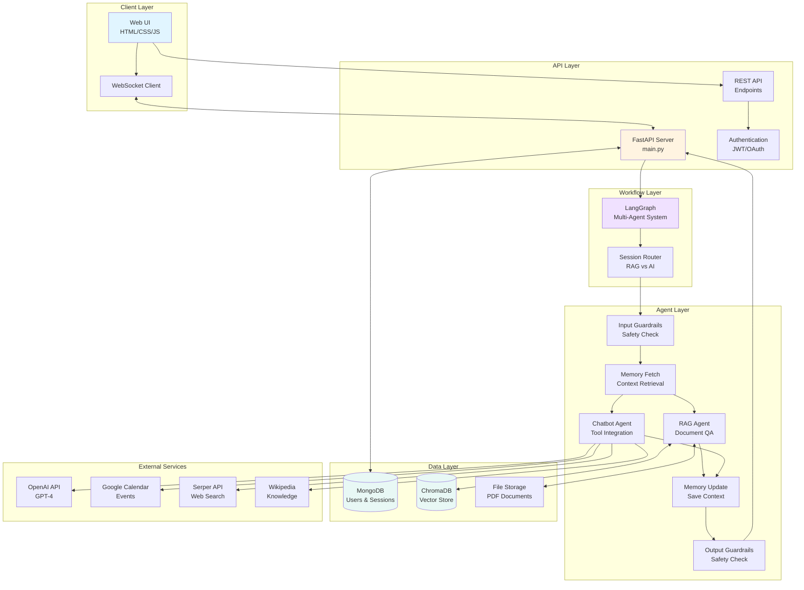
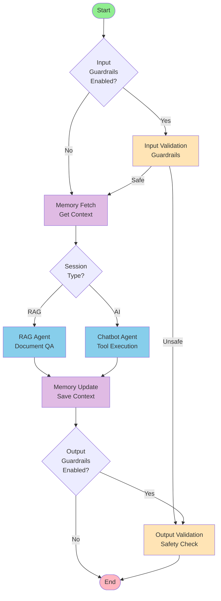
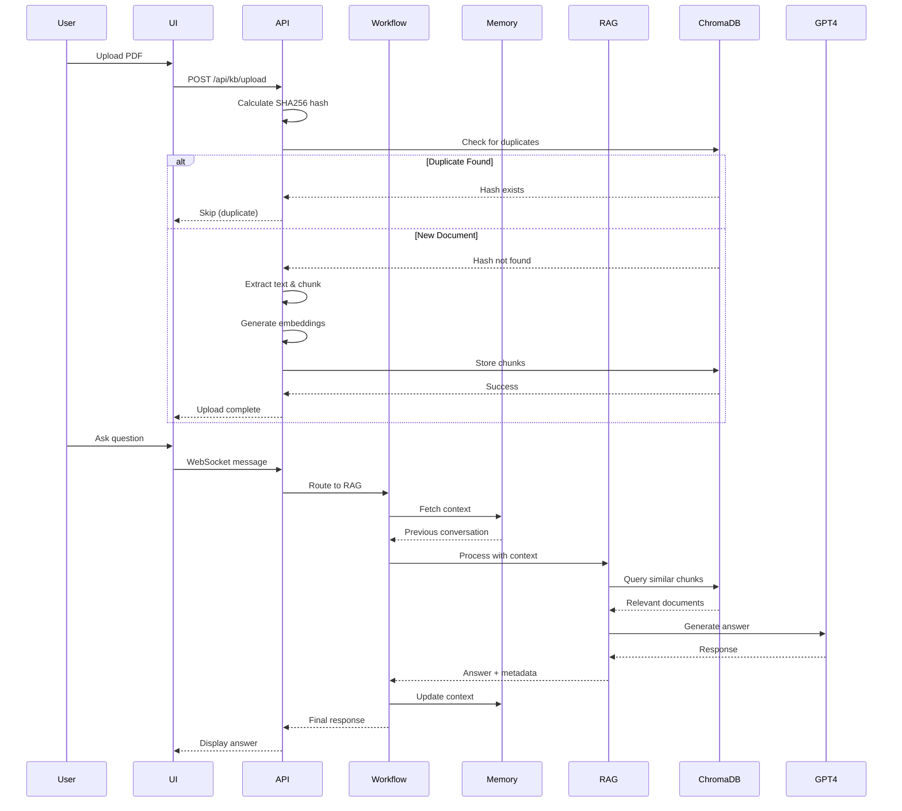
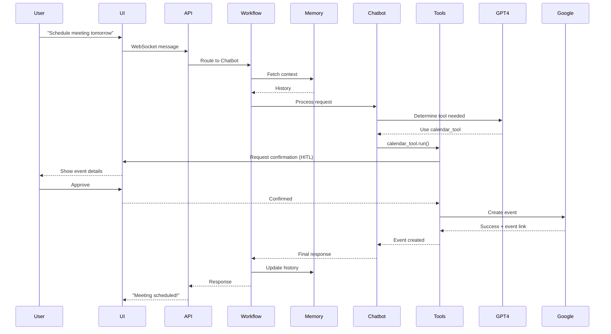

# Agentic RAG System

A production-ready, multi-agent conversational AI system that combines Retrieval-Augmented Generation (RAG) with intelligent agents, memory management, and tool integration.


---

## Table of Contents

- [Overview](#overview)
- [Key Features](#key-features)
- [System Architecture](#system-architecture)
- [Project Structure](#project-structure)
- [Components](#components)
- [Installation](#installation)
- [Configuration](#configuration)
- [Usage](#usage)
- [API Documentation](#api-documentation)
- [Advanced Features](#advanced-features)
- [Testing](#testing)
- [Contributing](#contributing)
- [License](#license)

---

##  Overview

This project implements a sophisticated **multi-agent conversational AI system** that intelligently routes between two specialized agents:

1. **Agentic AI (Chatbot)** - General-purpose conversational agent with access to external tools
2. **Agentic RAG** - Document-based question answering using retrieval-augmented generation

The system features:
-  **Persistent memory** across conversations
-  **Input/output guardrails** for content safety
-  **Tool integration** (calculator, web search, Google Calendar, Wikipedia)
-  **Dual knowledge base modes** (unified KB vs session-specific)
-  **Real-time WebSocket communication**
-  **Duplicate document detection** using SHA256 content hashing
-  **Progress tracking** for all long-running operations

---

##  Key Features

### Multi-Agent System
- **Session-based routing** between RAG and Chatbot agents
- **LangGraph workflow** for complex agent orchestration
- **Memory integration** for context-aware conversations
- **Guardrails** to prevent harmful inputs/outputs

### RAG Capabilities
- **Two KB modes**:
  - **Unified KB**: Shared knowledge base across all sessions
  - **Specific Files**: Session-isolated document collections
- **Content-based duplicate detection** (SHA256 hashing)
- **Multi-file upload** with real-time progress tracking
- **Local embeddings** using Sentence Transformers (no API costs)
- **ChromaDB** for vector storage

### Agentic AI Capabilities
- **External tools**: Calculator, datetime, web search, Wikipedia, Google Calendar
- **Human-in-the-loop** (HITL) for Google Calendar event creation
- **Tool execution tracking** and error handling
- **Context-aware** responses using conversation memory

### User Interface
- **Modern responsive design** with professional UI/UX
- **Real-time chat** using WebSocket connections
- **Session management** dashboard
- **Progress indicators** for file uploads and processing
- **Mobile-friendly** design

### Security & Safety
- **JWT authentication** with secure token management
- **Input guardrails** using custom guardrails system
- **Output validation** to prevent harmful responses
- **Session isolation** for data privacy

---

##  System Architecture

### High-Level Architecture



### LangGraph Workflow



### Data Flow - RAG Session



### Data Flow - AI Session with Tools



---

##  Project Structure

```
agentic-rag/
│
├── core/                      # Core application components
│   ├── api/                   # REST API endpoints
│   │   ├── auth.py           # Authentication endpoints
│   │   ├── knowledge_base.py # KB upload & management
│   │   └── sessions.py       # Session management
│   ├── auth/                  # Authentication logic
│   │   ├── jwt_handler.py    # JWT token management
│   │   └── oauth.py          # Google OAuth integration
│   ├── cache/                 # Redis caching layer
│   ├── database/              # MongoDB integration
│   │   └── manager.py        # Database operations
│   ├── llm/                   # LLM configuration
│   │   └── openai_client.py  # OpenAI client setup
│   ├── vector_store/          # ChromaDB integration
│   │   └── chroma_client.py  # Vector store operations
│   ├── websocket/             # WebSocket handling
│   │   └── handler.py        # Real-time messaging
│   ├── templates/             # Jinja2 templates
│   └── config.py             # Configuration management
│
├── graph/                     # LangGraph multi-agent workflow
│   ├── workflow.py           # Main workflow orchestration
│   ├── rag_node.py           # RAG agent node
│   ├── chat_node.py          # Chatbot agent node
│   ├── memory_nodes.py       # Memory fetch/update nodes
│   ├── guardrails_nodes.py   # Safety guardrails nodes
│   ├── calendar_node.py      # Calendar integration node
│   └── README.md             # Workflow documentation
│
├── memory/                    # Memory management system
│   ├── mem_agent.py          # Memory agent implementation
│   ├── mem_config.py         # Memory configuration
│   └── README.md             # Memory documentation
│
├── rag_agent/                 # RAG implementation
│   ├── ragagent_simple.py    # Simple RAG agent
│   ├── build_kb_simple.py    # KB building with deduplication
│   ├── pdf_extractor.py      # PDF text extraction
│   ├── embedding_helpers.py  # Embedding generation
│   └── local_embeddings.py   # Local Sentence Transformers
│
├── tools/                     # Agent tools
│   ├── calculator_tool.py    # Mathematical calculations
│   ├── datetime_tool.py      # Date/time operations
│   ├── google_calendar_tool.py # Calendar management (HITL)
│   ├── serper_tool.py        # Web search
│   └── wikipedia_tool.py     # Wikipedia queries
│
├── models/                    # Pydantic data models
│   └── models.py             # Request/response schemas
│
├── templates/                 # HTML templates
│   ├── dashboard.html        # Session management UI
│   ├── chat.html             # Chat interface
│   ├── login.html            # Authentication page
│   └── register.html         # Registration page
│
├── static/                    # Static assets
│   ├── css/                  # Stylesheets
│   ├── js/                   # JavaScript files
│   └── img/                  # Images
│
├── data/                      # Application data
│   ├── chroma_db/            # ChromaDB storage
│   └── uploads/              # Uploaded PDF files
│
├── test_scripts/              # Testing utilities
│   ├── test_integration.py   # Integration tests
│   ├── test_memory_workflow.py # Memory tests
│   ├── test_guardrails.py    # Guardrails tests
│   └── test_simple_rag.py    # RAG tests
│
├── utils/                     # Utility functions
│   └── track_progress.py     # Progress tracking
│
├── docs/                      # Detailed documentation
│   ├── AGENTIC_RAG.md        # RAG system docs
│   ├── AGENTIC_AI.md         # Chatbot agent docs
│   ├── MEMORY.md             # Memory system docs
│   ├── TOOLS.md              # Tools documentation
│   └── GUARDRAILS.md         # Guardrails docs
│
├── main.py                    # FastAPI application entry point
├── requirements.txt           # Python dependencies
├── .env.example              # Environment variables template
└── README.md                 # This file
```

---

##  Components

### 1. **Agentic RAG** ([Details](docs/AGENTIC_RAG.md))
Document-based question answering with two knowledge base modes:
- **Unified KB**: Shared across all sessions
- **Specific Files**: Session-isolated documents
- Features: Duplicate detection, multi-file upload, progress tracking

### 2. **Agentic AI** ([Details](docs/AGENTIC_AI.md))
Conversational agent with tool integration:
- **Tools**: Calculator, datetime, web search, Wikipedia, Google Calendar
- **HITL**: Human-in-the-loop for calendar events
- **Context-aware**: Uses memory for personalized responses

### 3. **Memory System** ([Details](docs/MEMORY.md))
Persistent conversation memory:
- **ChromaDB-based** storage
- **Semantic search** for relevant context
- **Automatic summarization** for long conversations

### 4. **Tools** ([Details](docs/TOOLS.md))
Integrated external capabilities:
- **Calculator**: Mathematical computations
- **Datetime**: Date/time operations
- **Google Calendar**: Event management with HITL
- **Serper**: Web search
- **Wikipedia**: Knowledge retrieval

### 5. **Guardrails** ([Details](docs/GUARDRAILS.md))
Safety and content moderation:
- **Input validation**: Prevent harmful queries
- **Output filtering**: Ensure safe responses
- **Guardrails** integration

---

##  Installation

### Prerequisites

- Python 3.12+
- MongoDB 4.4+
- OpenAI API key
- (Optional) Google Cloud credentials for Calendar integration
- (Optional) Serper API key for web search

### Step 1: Clone the Repository

```bash
git clone https://github.com/your-username/agentic-rag.git
cd agentic-rag
```

### Step 2: Create Virtual Environment

```bash
python -m venv .ragenv
source .ragenv/bin/activate  # On Windows: .ragenv\Scripts\activate
```

### Step 3: Install Dependencies

```bash
pip install -r requirements.txt
```

### Step 4: Set Up Environment Variables

```bash
cp .env.example .env
```

Edit `.env` and configure:

```env
# OpenAI Configuration
OPENAI_API_KEY=your_openai_api_key_here
OPENAI_MODEL=gpt-4-turbo-preview

# MongoDB Configuration
MONGO_URI=mongodb://localhost:27017
MONGO_DB_NAME=agentic_rag

# JWT Configuration
JWT_SECRET_KEY=your_super_secret_jwt_key_here
JWT_ALGORITHM=HS256
JWT_EXPIRATION_HOURS=24

# Google OAuth (Optional)
GOOGLE_CLIENT_ID=your_google_client_id
GOOGLE_CLIENT_SECRET=your_google_client_secret

# Serper API (Optional)
SERPER_API_KEY=your_serper_api_key

# Application Configuration
ENABLE_GUARDRAILS=true
LOG_LEVEL=INFO
```

### Step 5: Initialize Database

MongoDB will automatically create collections on first use. No manual setup required.

### Step 6: Run the Application

```bash
uvicorn main:app --reload --host 0.0.0.0 --port 8000
```

Access the application at: `http://localhost:8000`

---

##  Configuration

### Environment Variables

| Variable | Description | Default |
|----------|-------------|---------|
| `OPENAI_API_KEY` | OpenAI API key | - |
| `OPENAI_MODEL` | GPT model to use | `gpt-4o-mini` | 
| `MONGO_URI` | MongoDB connection string | `mongodb://localhost:27017` |
| `MONGO_DB_NAME` | Database name | `agentic_rag` |
| `JWT_SECRET_KEY` | JWT signing key | - | Yes |
| `ENABLE_GUARDRAILS` | Enable safety guardrails | `true` |
| `GOOGLE_CLIENT_ID` | Google OAuth client ID | - |
| `SERPER_API_KEY` | Serper API key | - |

### RAG Configuration

Edit `rag_agent/build_kb_simple.py`:

```python
chunk_size = 500        # Words per chunk
chunk_overlap = 50      # Overlapping words
```

### Memory Configuration

Edit `memory/mem_config.py`:

```python
MAX_MEMORY_SIZE = 10    # Maximum stored messages
SIMILARITY_THRESHOLD = 0.7  # Minimum similarity score
```

---

## Usage

### 1. Register/Login

Navigate to `http://localhost:8000` and create an account or login.

### 2. Create a Session

Choose between:
- **Agentic AI**: General conversation with tool access
- **Agentic RAG**: Document-based Q&A

For RAG sessions, select knowledge base mode:
- **Unified KB**: Access shared documents
- **Specific Files**: Isolated document collection

### 3. Upload Documents (RAG Only)

1. Click "Upload File to KB"
2. Select PDF file(s)
3. Watch progress bar for upload/processing status
4. Duplicate files are automatically detected and skipped

### 4. Start Chatting

**RAG Example:**
```
You: What are the key findings in the research paper?
AI: Based on the document, the key findings are...
```

**AI Example:**
```
You: What's 15% of 2500?
AI: [Using calculator] 15% of 2500 is 375.

You: Schedule a meeting for tomorrow at 2pm
AI: [Shows event details for confirmation]
You: [Approves]
AI: Meeting scheduled! [Google Calendar link]
```

---

##  API Documentation

### Authentication

**Register User**
```http
POST /api/auth/register
Content-Type: application/json

{
  "email": "user@example.com",
  "password": "secure_password"
}
```

**Login**
```http
POST /api/auth/login
Content-Type: application/json

{
  "email": "user@example.com",
  "password": "secure_password"
}

Response: { "access_token": "jwt_token", "token_type": "bearer" }
```

### Sessions

**Create Session**
```http
POST /api/sessions
Authorization: Bearer <token>
Content-Type: application/json

{
  "name": "Research Session",
  "description": "Analyzing research papers",
  "session_type": "rag",
  "rag_mode": "unified_kb"
}
```

**Get Sessions**
```http
GET /api/sessions
Authorization: Bearer <token>
```

### Knowledge Base

**Upload Documents**
```http
POST /api/kb/upload
Authorization: Bearer <token>
Content-Type: multipart/form-data

files: [file1.pdf, file2.pdf]
session_id: "session_id_here"
```

**Check Upload Status**
```http
GET /api/kb/status/{task_id}
Authorization: Bearer <token>

Response: {
  "status": "processing",
  "progress": 75,
  "message": "Generating embeddings...",
  "files_processed": 1,
  "total_files": 2
}
```

### WebSocket

**Connect**
```javascript
const ws = new WebSocket('ws://localhost:8000/ws');
ws.onopen = () => {
  ws.send(JSON.stringify({
    type: 'auth',
    token: 'jwt_token',
    session_id: 'session_id'
  }));
};
```

**Send Message**
```javascript
ws.send(JSON.stringify({
  type: 'message',
  content: 'What is the main topic of the document?'
}));
```

---

##  Advanced Features

### Duplicate Detection

Prevents uploading the same document multiple times:
- Uses **SHA256 content hashing** (not filename)
- Detects duplicates even if file is renamed
- Shows clear messages: "All 2 file(s) already exist in knowledge base"

### Progress Tracking

Real-time feedback for long operations:
- File upload: 5% → 10%
- Text extraction: 30%
- Embedding generation: 70%
- Finalization: 90% → 100%

### Human-in-the-Loop (HITL)

Google Calendar tool requires user confirmation:
1. AI proposes event details
2. User reviews and approves/rejects
3. Event is created only after approval

### Session Isolation

RAG "Specific Files" mode:
- Each session has isolated ChromaDB collection: `session_{session_id}`
- Documents are not shared between sessions
- Perfect for confidential documents

---

##  Testing

### Run All Tests

```bash
python -m pytest test_scripts/
```

### Individual Tests

**Memory System:**
```bash
python test_scripts/test_memory_workflow.py
```

**RAG Agent:**
```bash
python test_scripts/test_simple_rag.py
```

**Guardrails:**
```bash
python test_scripts/test_guardrails.py
```

**Integration:**
```bash
python test_scripts/test_integration.py
```

---

##  Contributing

We welcome contributions! Please:

1. Fork the repository
2. Create a feature branch: `git checkout -b feature/amazing-feature`
3. Commit changes: `git commit -m 'Add amazing feature'`
4. Push to branch: `git push origin feature/amazing-feature`
5. Open a Pull Request

---

##  License

This project is licensed under the MIT License - see the [LICENSE](LICENSE) file for details.

---

## Further Reading

- [Agentic RAG Deep Dive](READMEs/AGENTIC_RAG.md)
- [Agentic AI Architecture](READMEs/AGENTIC_AI.md)
- [Memory System Details](READMEs/MEMORY.md)
- [Tools Integration Guide](READMEs/TOOLS.md)
- [Guardrails Configuration](READMEs/GUARDRAILS.md)

---

##  Acknowledgments

- **LangChain & LangGraph** - Multi-agent orchestration
- **OpenAI** - GPT-4 language model
- **ChromaDB** - Vector storage
- **FastAPI** - Web framework
- **MongoDB** - Database
- **Guardrails** - Content safety

---

##  Support

For issues, questions, or suggestions:
- Open an [Issue](https://github.com/abdelmageed95/agentic-rag/issues)
- Join our [Discussions](https://github.com/abdelmageed95/agentic-rag/discussions)

---

**Built with using LangGraph, FastAPI, MongoDB, and ChromaDB**
