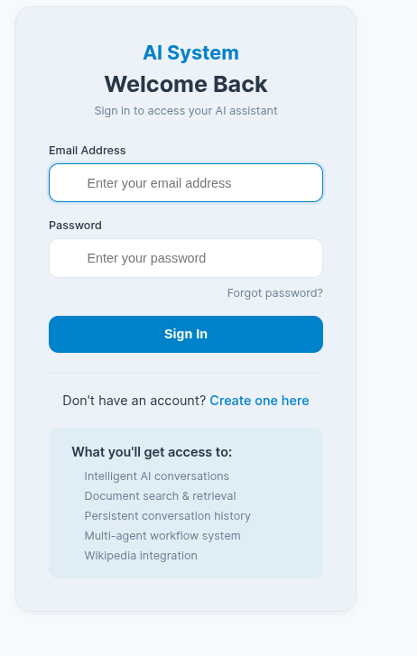
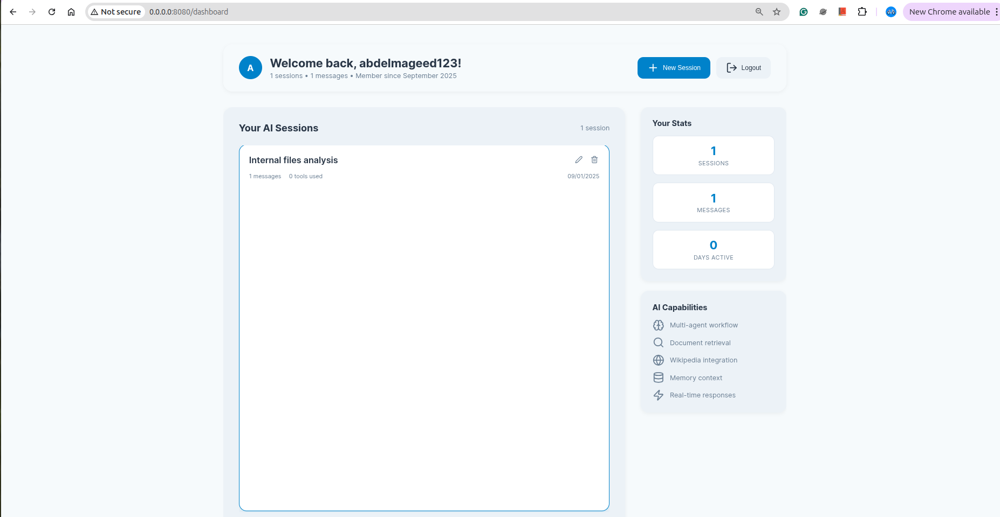
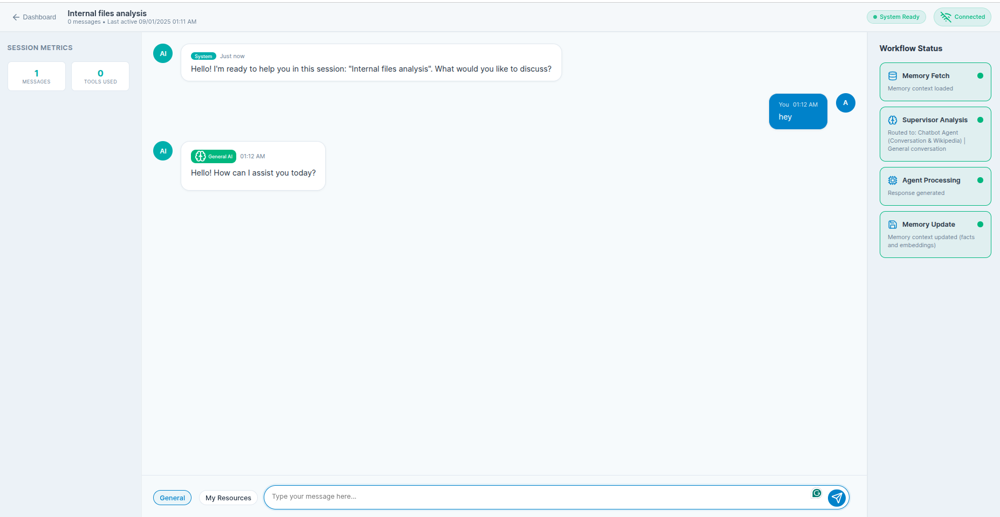

# Agentic RAG - Multi-Agent AI System

A sophisticated multi-agent AI system built with FastAPI, LangGraph, and MongoDB that provides intelligent document analysis, retrieval-augmented generation (RAG), and conversational AI capabilities with user authentication and session management.

## 🚀 Features

### Core Capabilities
- **Multi-Agent Architecture**: Intelligent routing between specialized AI agents (RAG, Chatbot, Memory)
- **Document Processing**: Advanced PDF processing with text and image extraction
- **RAG System**: Multimodal retrieval-augmented generation with FAISS indexing
- **Real-time Streaming**: WebSocket-based real-time responses with progress tracking
- **Memory Management**: Persistent conversation memory with MongoDB storage
- **User Authentication**: Secure JWT-based authentication with session management

### System Components

#### Authentication & User Management
- User registration and login with secure password hashing (bcrypt)
- JWT token-based authentication with configurable expiration
- Session management with MongoDB persistence
- Multi-user support with isolated data

#### Multi-Agent Workflow
- **Supervisor Agent**: Intelligent routing based on user intent and chat mode
- **RAG Agent**: Document retrieval and analysis using FAISS vector search
- **Chatbot Agent**: General conversation with Wikipedia integration
- **Memory Agent**: Context-aware conversation history management

#### Document Processing
- PDF text extraction and chunking
- Image extraction from PDFs with OCR capabilities
- Multimodal embedding generation (text + image)
- FAISS vector indexing for efficient similarity search

## 📊 System Architecture

The system uses a LangGraph-based workflow for intelligent agent routing:

```
                    ┌────────────┐
                    │   START    │
                    └────┬───────┘
                         │
                         ▼
                    ┌──────────────┐
                    │ memory_fetch │
                    └────┬─────────┘
                         │
                         ▼
                    ┌────────────┐
                    │ supervisor │
                    └────┬───────┘
                         │
               ┌────────▼────────┐
               │  route_to_agent │
               └────┬──────┬─────┘
                    ▼      ▼
               ┌───────┐ ┌────────┐
               │chatbot│ │rag_agent│
               └──┬────┘ └────┬───┘
                    ▼      ▼
               ┌────────────────┐
               │ memory_update  │
               └──────┬─────────┘
                      ▼
                    ┌────┐
                    │ END│
                    └────┘
```

**Workflow Steps:**
1. **Memory Fetch**: Retrieve conversation context and history
2. **Supervisor**: Analyze user intent and determine appropriate agent
3. **Route to Agent**: Direct to either Chatbot or RAG Agent
4. **Agent Processing**: Generate response based on specialization
5. **Memory Update**: Store conversation and context for future reference

## 🛠️ Technology Stack

### Backend
- **FastAPI**: High-performance web framework
- **LangGraph**: Agent workflow orchestration
- **MongoDB**: Document database with Motor async driver
- **FAISS**: Vector similarity search
- **OpenAI**: LLM integration
- **Google Gemini**: Alternative LLM provider
- **Cohere**: Additional embedding support

### Frontend
- **Jinja2 Templates**: Server-side rendering
- **WebSocket**: Real-time communication
- **JWT Authentication**: Secure session management

### AI/ML Libraries
- **LangChain**: LLM application framework
- **Qdrant**: Vector database support
- **PaddleOCR**: Optical character recognition
- **PIL**: Image processing

## 📁 Project Structure

```
agentic-rag/
├── main.py                 # Lightweight FastAPI application entry point
├── core/                   # Core modular components
│   ├── config.py          # Application configuration
│   ├── auth/              # Authentication module
│   │   ├── jwt_handler.py # JWT token management
│   │   ├── dependencies.py # FastAPI auth dependencies
│   │   └── utils.py       # Password hashing utilities
│   ├── database/          # Database operations
│   │   └── manager.py     # MongoDB database manager
│   ├── api/               # API route modules
│   │   ├── auth.py        # Authentication routes
│   │   ├── sessions.py    # Session management routes
│   │   ├── chat.py        # Chat endpoints
│   │   └── health.py      # Health check endpoint
│   ├── websocket/         # WebSocket handling
│   │   ├── manager.py     # Multi-agent WebSocket manager
│   │   └── handler.py     # WebSocket connection handling
│   └── templates/         # Template utilities
│       └── fallbacks.py   # Fallback HTML templates
├── models/
│   └── models.py          # Pydantic models and state definitions
├── graph/                 # LangGraph workflow system
│   ├── workflow.py        # LangGraph workflow implementation
│   ├── supervisor.py      # Agent routing logic
│   ├── rag_node.py       # RAG agent implementation
│   ├── chat_node.py      # Chatbot agent implementation
│   └── memory_nodes.py   # Memory management nodes
├── rag_agent/             # RAG system components
│   ├── ragagent.py       # RAG system implementation
│   ├── embedding_helpers.py # Embedding utilities
│   ├── loading_helpers.py   # Data loading utilities
│   └── build_kb.py       # Knowledge base building
├── memory/                # Memory management
│   ├── mem_agent.py      # Memory agent implementation
│   └── mem_config.py     # Memory configuration
├── tools/                 # External tools integration
│   └── wikipedia_tool.py # Wikipedia search tool
├── utils/                 # Utility functions
│   └── track_progress.py # Progress tracking utilities
├── templates/            # HTML templates
├── static/              # Static assets (CSS, JS)
├── data/                # Processed documents and indices
├── pdfs/                # Source PDF documents
└── img/                 # System screenshots
```

### New Modular Architecture Benefits

- **Separation of Concerns**: Each module has a specific responsibility
- **Maintainable Code**: Easy to locate and modify functionality
- **Testability**: Individual components can be tested in isolation
- **Scalability**: Components can be easily extended or replaced
- **Professional Structure**: Industry-standard project organization

## 🔧 Installation & Setup

### Prerequisites
- Python 3.12+
- MongoDB (local or cloud instance)
- OpenAI API key
- Google Gemini API key (optional)

### Installation Steps

1. **Clone the repository**
```bash
git clone <repository-url>
cd agentic-rag
```

2. **Create virtual environment**
```bash
python -m venv .ragenv
source .ragenv/bin/activate  # Linux/Mac
# or
.ragenv\Scripts\activate     # Windows
```

3. **Install dependencies**
```bash
pip install -r requirements.txt
```

4. **Environment Configuration**
Create a `.env` file with the following variables:
```env
OPENAI_API_KEY=your_openai_api_key
MONGODB_URL=mongodb://localhost:27017
JWT_SECRET=your_jwt_secret_key
GOOGLE_API_KEY=your_google_api_key  # Optional
COHERE_API_KEY=your_cohere_api_key  # Optional
```

5. **Database Setup**
Ensure MongoDB is running and accessible at the configured URL.

6. **Document Processing (Optional)**
Place PDF documents in the `pdfs/` directory and run the document processing pipeline to create FAISS indices.

## 📷 Screenshots

### User Authentication


*Clean and professional login interface with email/password authentication*


*User registration form with username, email, and optional full name fields*

### Dashboard & Session Management

*Main dashboard showing user statistics, session management, and AI capabilities overview*

### Interactive Chat Interface

*Real-time chat interface with multi-agent workflow tracking, progress indicators, and response streaming*

### Key UI Features Shown:
- **Secure Authentication**: JWT-based login with professional UI design
- **Session Management**: Create, manage, and switch between different chat sessions
- **Real-time Workflow**: Live progress tracking showing which agent is processing
- **Multi-Agent Indicators**: Visual feedback on RAG vs Chatbot agent selection
- **Responsive Design**: Clean, modern interface with intuitive navigation
- **Activity Tracking**: User statistics and session metrics display

## 🚀 Running the Application

### Development Mode
```bash
python main.py
```
The application will start at `http://localhost:8080`

### Production Mode
```bash
uvicorn main:app --host 0.0.0.0 --port 8080 --workers 4
```

## 💻 Usage

### User Interface

### 1. Registration & Login
- Navigate to the application URL
- Create a new account or login with existing credentials
- JWT tokens are automatically managed via HTTP-only cookies

### 2. Session Management
- Create new chat sessions from the dashboard
- Each session maintains independent conversation history
- Sessions can be renamed, deleted, or archived

### 3. Multi-Modal Interactions
- **General Chat**: Ask questions, get Wikipedia-enhanced responses
- **Document Search**: Query uploaded PDFs and images
- **My Resources**: Access personal document collections

### 4. Real-Time Features
- Live response streaming during agent processing
- Workflow status updates showing current processing step
- Progress indicators for long-running operations

## 🔌 API Endpoints

### Authentication
- `POST /register` - User registration
- `POST /login` - User login
- `POST /logout` - User logout

### Session Management
- `GET /api/sessions` - List user sessions
- `POST /api/sessions` - Create new session
- `PUT /api/sessions/{id}` - Update session
- `DELETE /api/sessions/{id}` - Delete session

### Chat
- `POST /api/chat` - Send chat message
- `WS /ws/{session_id}` - WebSocket connection for real-time chat

### System
- `GET /health` - System health check
- `GET /api/me` - Current user information

## 🧪 System Features

### Multi-Agent Intelligence
The system automatically routes user queries to the most appropriate agent:
- **Document queries** → RAG Agent (searches PDFs, images)
- **General questions** → Chatbot Agent (Wikipedia-enhanced responses)
- **Context-dependent** → Memory-aware routing

### Advanced RAG Capabilities
- Multimodal document processing (text + images)
- Semantic similarity search with FAISS
- Context-aware response generation
- Source citation and evidence linking

### Memory & Persistence
- Conversation history stored in MongoDB
- Cross-session memory continuity
- User-specific data isolation
- Automatic context summarization

## 📈 Monitoring & Logging

The application includes comprehensive logging:
- Authentication events
- Agent routing decisions
- Processing performance metrics
- Error tracking and debugging

Console output provides real-time insights into system operation with emoji-coded status messages.

## 🔐 Security Features

- **Password Security**: bcrypt hashing with salt
- **JWT Authentication**: Secure token-based sessions
- **HTTP-Only Cookies**: XSS protection
- **CORS Configuration**: Controlled cross-origin access
- **Input Validation**: Pydantic model validation
- **Database Security**: Parameterized queries, injection protection

## 🚧 Development

### Adding New Agents
1. Create agent implementation in `graph/`
2. Add routing logic to supervisor
3. Update workflow in `workflow.py`
4. Test integration with existing memory system

### Extending Document Support
1. Add new processors in `rag_agent/`
2. Update embedding generation
3. Extend FAISS indexing
4. Test multimodal retrieval

## 📝 Configuration

### Environment Variables
- `OPENAI_API_KEY`: Required for LLM functionality
- `MONGODB_URL`: Database connection string
- `JWT_SECRET`: Authentication secret key
- `ENVIRONMENT`: Set to "production" for production mode
- `ALLOWED_ORIGINS`: CORS allowed origins (production)

### System Defaults
- Session expiration: 7 days
- JWT algorithm: HS256
- Default port: 8080
- MongoDB database: "agentic_memory"

## 🤝 Contributing

1. Fork the repository
2. Create a feature branch
3. Implement changes with tests
4. Submit pull request with detailed description

