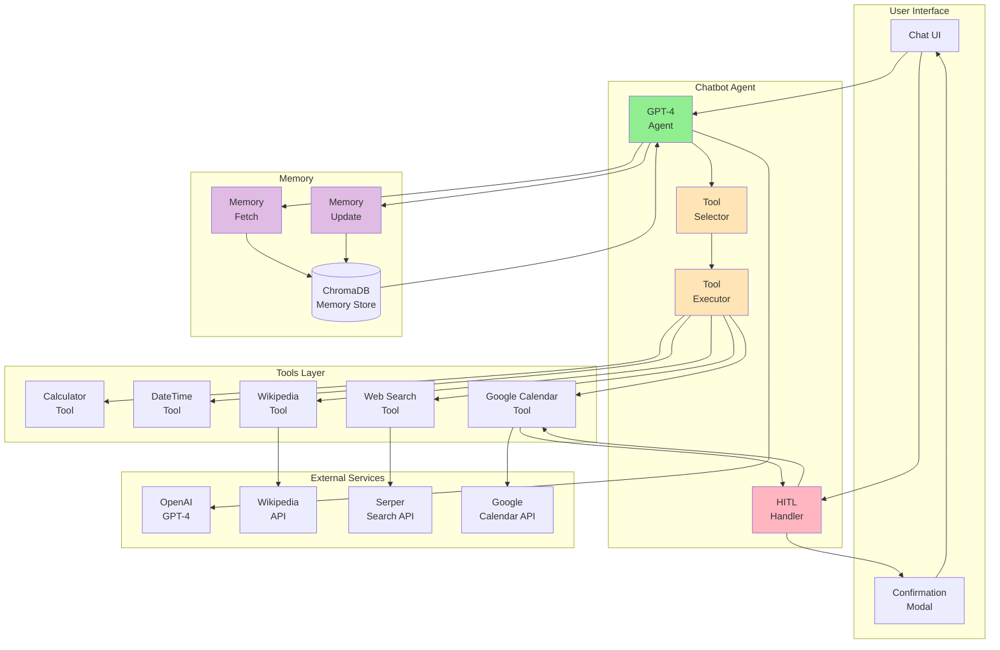
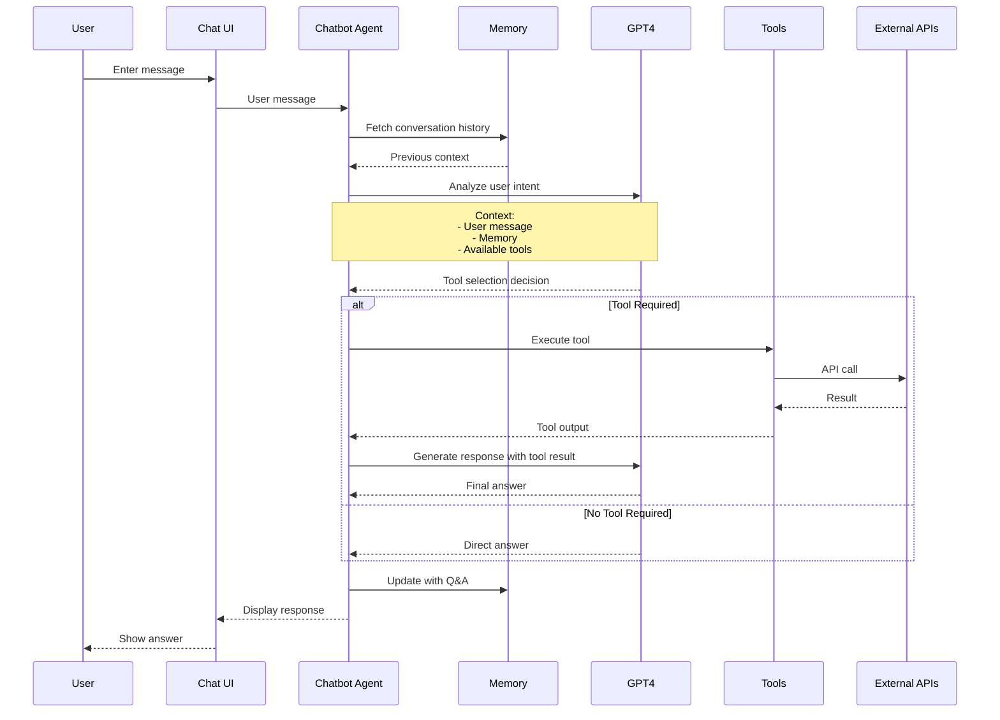
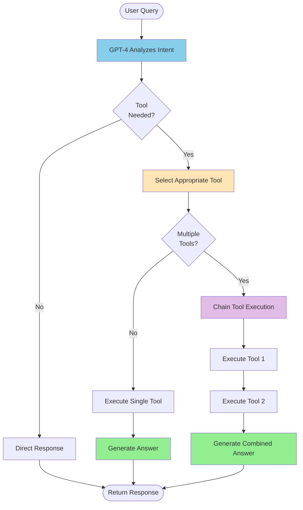
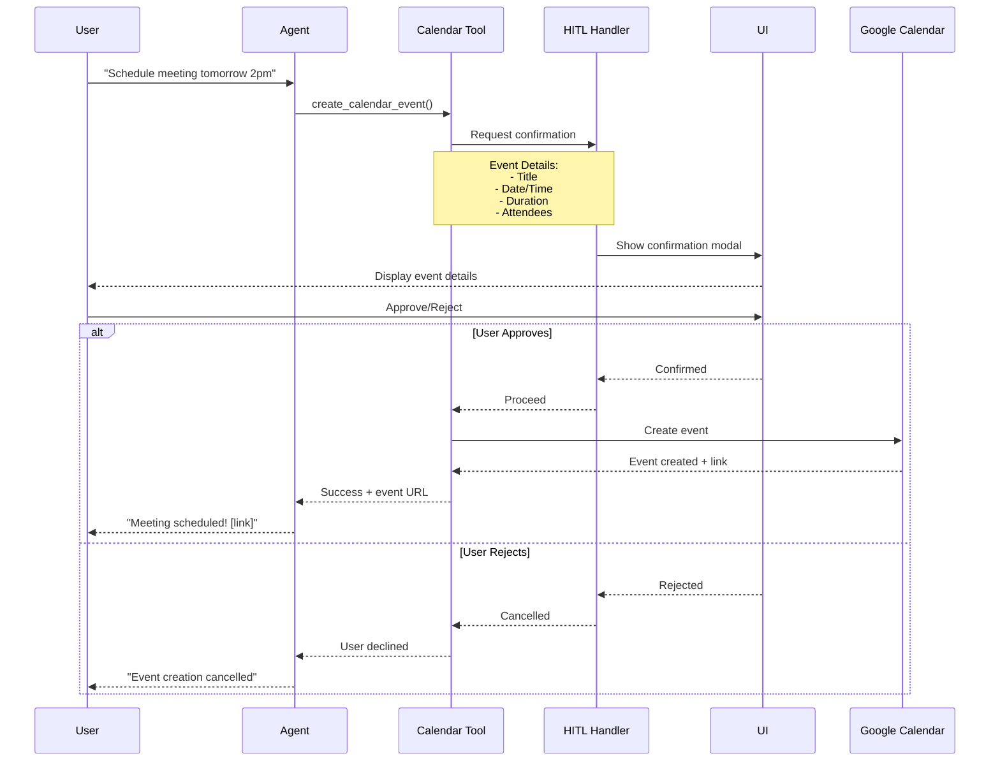
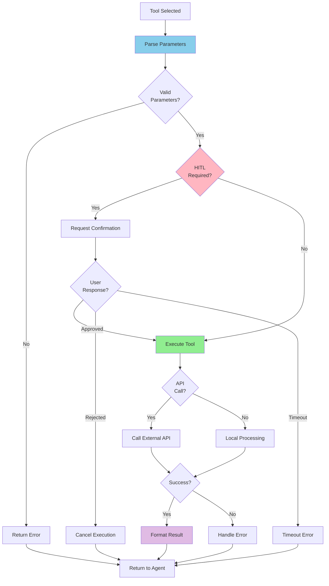

# Agentic AI - Intelligent Conversational Agent

Comprehensive documentation for the Chatbot Agent with tool integration, human-in-the-loop capabilities, and context-aware conversations.

---

## 📋 Table of Contents

- [Overview](#overview)
- [Architecture](#architecture)
- [Tool Integration](#tool-integration)
- [Human-in-the-Loop (HITL)](#human-in-the-loop-hitl)
- [Conversation Flow](#conversation-flow)
- [Available Tools](#available-tools)
- [Tool Execution](#tool-execution)
- [Context Management](#context-management)
- [Error Handling](#error-handling)
- [Configuration](#configuration)
- [Best Practices](#best-practices)

---

## 🌟 Overview

The Agentic AI system is a **general-purpose conversational agent** powered by GPT-4 with access to external tools for enhanced capabilities. It can:

- 🧮 **Perform calculations** and unit conversions
- 🔍 **Search the web** for current information
- 📅 **Manage calendar events** with human approval
- 📚 **Query Wikipedia** for factual knowledge
- 🕐 **Handle date/time operations** and timezone conversions
- 💬 **Maintain conversation context** using persistent memory

### Key Features

✅ **Multi-tool orchestration** - Intelligently selects and chains tools
✅ **Human-in-the-loop** - Requires confirmation for sensitive actions
✅ **Memory integration** - Context-aware across conversation turns
✅ **Error recovery** - Graceful handling of tool failures
✅ **Real-time streaming** - Progressive response generation

---

## 🏗️ Architecture

### Component Diagram



### Conversation Flow



---

## 🛠️ Tool Integration

### Tool Architecture

```mermaid
graph LR
    subgraph "Tool Definition"
        Name[Tool Name]
        Desc[Description]
        Params[Parameters]
        Schema[JSON Schema]
    end

    subgraph "LangChain Tool"
        LC[LangChain<br/>@tool decorator]
    end

    subgraph "Execution"
        Validate[Validate<br/>Parameters]
        Execute[Execute<br/>Logic]
        Return[Return<br/>Result]
    end

    Name --> LC
    Desc --> LC
    Params --> Schema
    Schema --> LC

    LC --> Validate
    Validate --> Execute
    Execute --> Return

    style LC fill:#87CEEB
    style Validate fill:#FFE4B5
    style Execute fill:#90EE90
```

### Tool Registration

```python
from langchain_core.tools import tool

@tool
def tool_name(param1: str, param2: int) -> str:
    """
    Tool description that GPT-4 uses to understand when to use this tool.

    Args:
        param1: Description of parameter 1
        param2: Description of parameter 2

    Returns:
        Description of return value
    """
    # Tool implementation
    result = perform_operation(param1, param2)
    return f"Result: {result}"
```

### Tool Selection Process



---

## 👤 Human-in-the-Loop (HITL)

### Workflow



### Implementation

**Calendar Tool with HITL:**

```python
@tool
async def create_calendar_event(
    summary: str,
    start_time: str,
    end_time: str,
    description: str = "",
    attendees: List[str] = []
) -> str:
    """
    Create a Google Calendar event (requires user confirmation).

    Args:
        summary: Event title
        start_time: Start time (ISO format)
        end_time: End time (ISO format)
        description: Event description
        attendees: List of email addresses

    Returns:
        Event creation result with link
    """

    # Prepare event details
    event_details = {
        "summary": summary,
        "start": {"dateTime": start_time},
        "end": {"dateTime": end_time},
        "description": description,
        "attendees": [{"email": email} for email in attendees]
    }

    # Request human confirmation
    confirmed = await request_hitl_confirmation(
        action="create_calendar_event",
        details=event_details
    )

    if not confirmed:
        return "Event creation cancelled by user"

    # User approved - create event
    service = get_calendar_service()
    event = service.events().insert(
        calendarId='primary',
        body=event_details
    ).execute()

    return f"Event created: {event.get('htmlLink')}"
```

### HITL Configuration

**File:** `tools/google_calendar_tool.py`

```python
# HITL settings
REQUIRE_CONFIRMATION = True  # Enable/disable HITL
CONFIRMATION_TIMEOUT = 60    # Seconds to wait for user response
```

---

## 💬 Conversation Flow

### Message Processing

**File:** `graph/chat_node.py`

```python
async def chatbot_agent_node(state: Dict) -> Dict:
    """
    Chatbot agent with tool integration and memory.
    """

    # Extract state
    session_id = state.get("session_id")
    user_message = state.get("user_message")
    memory_context = state.get("memory_context", "")

    # Build message history
    messages = []

    # System prompt
    messages.append(SystemMessage(content="""
    You are a helpful AI assistant with access to various tools.
    Use tools when necessary to provide accurate, up-to-date information.
    Be concise and helpful.
    """))

    # Add memory context
    if memory_context:
        messages.append(SystemMessage(content=f"Previous context: {memory_context}"))

    # Add user message
    messages.append(HumanMessage(content=user_message))

    # Create agent with tools
    llm = ChatOpenAI(model="gpt-4-turbo-preview", temperature=0)
    agent = llm.bind_tools(all_chatbot_tools)

    # Invoke agent
    response = await agent.ainvoke(messages)

    # Handle tool calls
    if response.tool_calls:
        tools_used = []
        for tool_call in response.tool_calls:
            tool_result = await execute_tool(tool_call)
            tools_used.append(tool_call["name"])

            # Add tool result to messages
            messages.append(ToolMessage(
                content=str(tool_result),
                tool_call_id=tool_call["id"]
            ))

        # Get final response with tool results
        final_response = await agent.ainvoke(messages)
        answer = final_response.content
    else:
        answer = response.content
        tools_used = []

    return {
        "agent_response": answer,
        "agent_type": "chatbot",
        "tools_used": tools_used
    }
```

### Multi-Turn Conversations

**Example:**

```
Turn 1:
User: "What's the weather in Paris?"
Agent: [Uses web_search] "Current weather in Paris is 18°C, partly cloudy"

Turn 2:
User: "Convert that to Fahrenheit"
Agent: [Uses calculator + memory] "18°C equals 64.4°F"
        ↑ Remembers "that" refers to Paris temperature

Turn 3:
User: "Schedule a call about our Paris trip tomorrow at 10am"
Agent: [Uses calendar_tool + memory]
       [Shows confirmation: "Paris Trip Call - Tomorrow 10:00 AM"]
       User approves
       "Meeting scheduled! [Google Calendar link]"
```

---

## 🔧 Available Tools

### 1. Calculator Tool

**File:** `tools/calculator_tool.py`

**Functions:**
- `calculate(expression: str)` - Evaluate math expressions
- `convert_units(value: float, from_unit: str, to_unit: str)` - Unit conversion

**Examples:**
```python
# Math calculations
calculate("15% of 2500")  # → "375.0"
calculate("(45 + 67) * 2.5")  # → "280.0"

# Unit conversions
convert_units(100, "km", "miles")  # → "62.137 miles"
convert_units(32, "fahrenheit", "celsius")  # → "0.0°C"
```

**Supported Units:**
- Distance: km, miles, meters, feet, yards
- Temperature: celsius, fahrenheit, kelvin
- Weight: kg, pounds, grams, ounces
- Volume: liters, gallons, milliliters

---

### 2. DateTime Tool

**File:** `tools/datetime_tool.py`

**Functions:**

| Function | Description | Example |
|----------|-------------|---------|
| `get_current_datetime()` | Current date/time | "2024-10-28 14:30:00 UTC" |
| `calculate_date_difference(date1, date2)` | Days between dates | "45 days" |
| `add_days_to_date(date, days)` | Add/subtract days | "2024-11-15" |
| `get_day_of_week(date)` | Get weekday | "Monday" |
| `convert_timezone(datetime, from_tz, to_tz)` | Timezone conversion | "2024-10-28 10:30 EST" |
| `get_calendar_month(year, month)` | Calendar display | ASCII calendar |
| `time_until_date(target_date)` | Countdown | "3 days, 5 hours" |

**Examples:**
```python
# Current time
get_current_datetime()
# → "2024-10-28 14:30:00 UTC"

# Date math
calculate_date_difference("2024-10-01", "2024-12-25")
# → "85 days"

# Timezone conversion
convert_timezone("2024-10-28 14:00", "UTC", "America/New_York")
# → "2024-10-28 10:00 EDT"
```

---

### 3. Wikipedia Tool

**File:** `tools/wikipedia_tool.py`

**Functions:**
- `search_wikipedia(query: str)` - Search Wikipedia articles
- `get_wikipedia_page(title: str)` - Get full article content

**Examples:**
```python
# Search for articles
search_wikipedia("Python programming")
# → ["Python (programming language)", "Python Software Foundation", ...]

# Get article content
get_wikipedia_page("Python (programming language)")
# → "Python is a high-level, interpreted programming language..."
```

---

### 4. Web Search Tool

**File:** `tools/serper_tool.py`

**Functions:**
- `search_web(query: str, num_results: int = 5)` - Web search
- `search_news(query: str, num_results: int = 5)` - News search

**Examples:**
```python
# Web search
search_web("latest AI developments 2024", num_results=3)
# → [{title, link, snippet}, ...]

# News search
search_news("climate change policy", num_results=5)
# → Recent news articles about climate change
```

**Requirements:**
- Serper API key in `.env`
- `SERPER_API_KEY=your_api_key`

---

### 5. Google Calendar Tool

**File:** `tools/google_calendar_tool.py`

**Functions:**
- `get_calendar_events(date: str)` - List events for a date
- `create_calendar_event(...)` - Create event (requires HITL)

**Examples:**
```python
# Get today's events
get_calendar_events("2024-10-28")
# → "Events for 2024-10-28:\n1. Team Meeting (10:00-11:00)\n2. Lunch (12:00-13:00)"

# Create event (triggers confirmation)
create_calendar_event(
    summary="Project Review",
    start_time="2024-10-29T14:00:00",
    end_time="2024-10-29T15:00:00",
    description="Q4 project review meeting",
    attendees=["team@company.com"]
)
# → Shows confirmation modal
# → After approval: "Event created: [Google Calendar link]"
```

**Setup:**
1. Enable Google Calendar API
2. Download credentials JSON
3. Place in project root
4. First run triggers OAuth flow

---

## ⚙️ Tool Execution

### Execution Pipeline



### Error Handling

**Graceful Degradation:**

```python
async def execute_tool(tool_call):
    """Execute tool with error handling"""

    try:
        tool = get_tool(tool_call["name"])
        args = tool_call["args"]

        # Validate parameters
        validated_args = validate_parameters(tool, args)

        # Execute tool
        result = await tool.ainvoke(validated_args)

        return {
            "success": True,
            "result": result
        }

    except ValidationError as e:
        return {
            "success": False,
            "error": f"Invalid parameters: {str(e)}"
        }

    except APIError as e:
        return {
            "success": False,
            "error": f"API error: {str(e)}",
            "fallback": "I encountered an error accessing that service. Please try again later."
        }

    except Exception as e:
        logger.error(f"Tool execution error: {e}")
        return {
            "success": False,
            "error": "Unexpected error",
            "fallback": "I couldn't complete that action. Please try rephrasing your request."
        }
```

---

## 🧠 Context Management

### Memory Integration

The chatbot agent integrates with the memory system to maintain conversation context:

**1. Memory Fetch** (before processing):
```python
memory_context = await memory_fetch_node(state)
# → "Previous conversation: User asked about weather in Paris (18°C)"
```

**2. Use in Prompt**:
```python
messages.append(SystemMessage(content=f"Context: {memory_context}"))
messages.append(HumanMessage(content="Convert that to Fahrenheit"))
# Agent understands "that" = 18°C from Paris
```

**3. Memory Update** (after response):
```python
await memory_update_node({
    "user_message": "Convert that to Fahrenheit",
    "agent_response": "18°C equals 64.4°F",
    "tools_used": ["calculator"]
})
```

### Context Window Management

**GPT-4 Limits:**
- Context window: 128K tokens
- Typical conversation: 2-4K tokens
- Memory summary: 500-1000 tokens

**Optimization:**
- Store only relevant context in memory
- Summarize old conversations
- Remove redundant information

---

## 📊 Performance Metrics

### Response Times

| Scenario | Average Time | Details |
|----------|--------------|---------|
| Simple question | 1-2 seconds | Direct GPT-4 response |
| Single tool use | 2-4 seconds | Tool execution + GPT-4 |
| Multiple tools | 4-8 seconds | Chained tool calls |
| HITL interaction | 30-60 seconds | Waiting for user confirmation |

### Tool Usage Statistics

```python
# Track tool usage per session
{
    "calculator": 5,
    "datetime": 3,
    "web_search": 2,
    "wikipedia": 1,
    "calendar": 1
}
```

---

## ⚙️ Configuration

### Agent Settings

**File:** `graph/chat_node.py`

```python
# LLM Configuration
MODEL = "gpt-4-turbo-preview"
TEMPERATURE = 0  # Deterministic responses
MAX_TOKENS = 4096

# Tool settings
MAX_TOOL_ITERATIONS = 5  # Prevent infinite loops
TOOL_TIMEOUT = 30  # Seconds per tool execution
```

### System Prompt

**Customize behavior:**

```python
SYSTEM_PROMPT = """
You are a helpful AI assistant with access to various tools.

Guidelines:
- Be concise and helpful
- Use tools when necessary for accurate information
- Always cite sources when using web search or Wikipedia
- For calculations, show your work
- Request confirmation for calendar events

Available tools:
- Calculator: Math and unit conversion
- DateTime: Date/time operations
- Wikipedia: Factual knowledge
- Web Search: Current information
- Google Calendar: Event management (requires approval)
"""
```

---

## 📚 Best Practices

### 1. Tool Selection

**When to use tools:**
```
✅ Math calculations → calculator_tool
✅ Current events → web_search
✅ Historical facts → wikipedia
✅ Date/time queries → datetime_tool
✅ Calendar management → google_calendar_tool

❌ General conversation → Direct GPT-4
❌ Opinion questions → Direct GPT-4
❌ Creative writing → Direct GPT-4
```

### 2. Error Messages

**User-friendly errors:**
```python
# Good
"I couldn't access the calendar right now. Please try again in a moment."

# Bad
"Error 403: Forbidden - Invalid OAuth token"
```

### 3. Tool Chaining

**Effective sequences:**
```
1. get_current_datetime() → "2024-10-28"
2. add_days_to_date("2024-10-28", 7) → "2024-11-04"
3. create_calendar_event(..., "2024-11-04") → Event created
```

### 4. HITL Usage

**Require confirmation for:**
- ✅ Calendar event creation
- ✅ Email sending (if implemented)
- ✅ File deletion (if implemented)
- ✅ Financial transactions (if implemented)

**Don't require for:**
- ❌ Information retrieval (search, Wikipedia)
- ❌ Calculations
- ❌ Date/time queries

---

## 🔗 Further Reading

- [Main README](../README.md)
- [Agentic RAG](AGENTIC_RAG.md)
- [Memory System](MEMORY.md)
- [Tools Documentation](TOOLS.md)
- [Guardrails](GUARDRAILS.md)

---

**Powered by GPT-4 and LangChain Tools**
