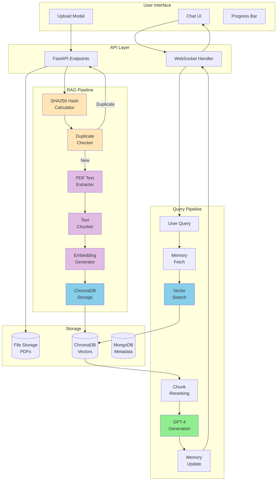
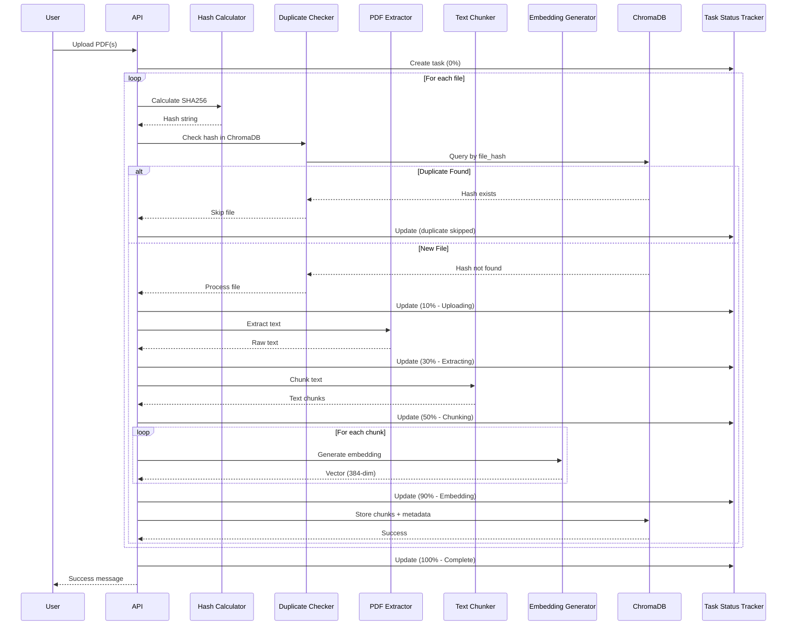
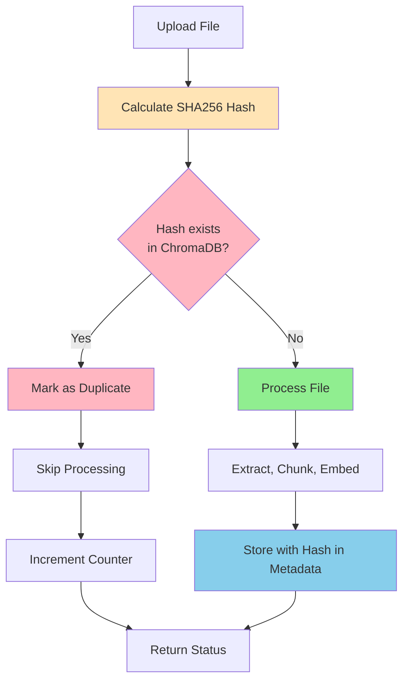
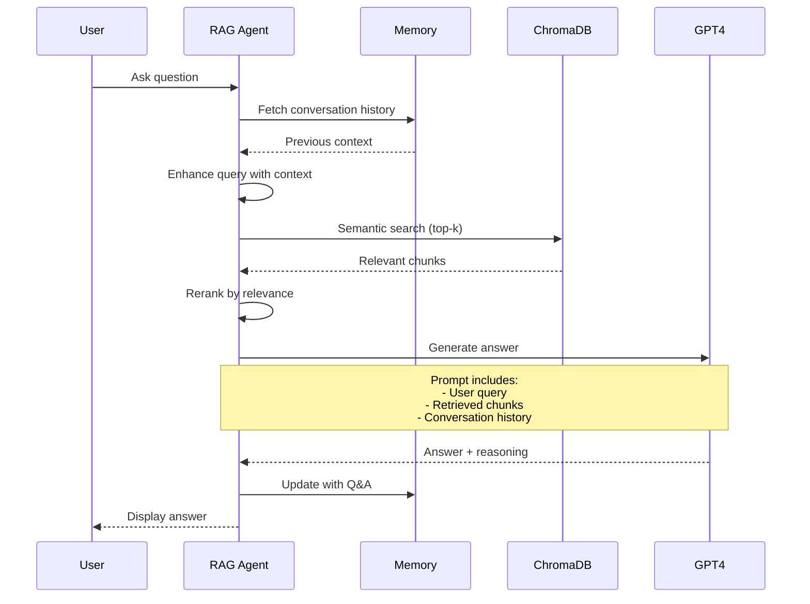

# Agentic RAG - Document-Based Question Answering

Comprehensive documentation for the Retrieval-Augmented Generation (RAG) system with intelligent document management, duplicate detection, and semantic search.

---

## 📋 Table of Contents

- [Overview](#overview)
- [Architecture](#architecture)
- [Knowledge Base Modes](#knowledge-base-modes)
- [Document Processing Pipeline](#document-processing-pipeline)
- [Duplicate Detection](#duplicate-detection)
- [RAG Agent](#rag-agent)
- [Vector Storage](#vector-storage)
- [API Reference](#api-reference)
- [Configuration](#configuration)
- [Performance](#performance)
- [Best Practices](#best-practices)

---

## 🌟 Overview

The Agentic RAG system enables users to have intelligent conversations with their documents. It combines:

- **Document ingestion** with PDF text extraction
- **Semantic chunking** for optimal retrieval
- **Local embeddings** using Sentence Transformers (no API costs)
- **Duplicate detection** via SHA256 content hashing
- **Two KB modes**: Unified (shared) vs Specific Files (isolated)
- **Context-aware QA** using GPT-4 with retrieved chunks

### Key Features

✅ **Multi-file upload** with progress tracking
✅ **Automatic duplicate detection** (content-based, not filename)
✅ **Session isolation** for confidential documents
✅ **Semantic search** using vector embeddings
✅ **Source attribution** in answers
✅ **Memory integration** for multi-turn conversations

---

## 🏗️ Architecture

### Component Diagram



### Document Processing Flow



---

## 🗂️ Knowledge Base Modes

### 1. Unified KB (Shared Knowledge Base)

**Collection Name:** `documents`

**Use Case:** Shared organizational knowledge accessible across all sessions.

**Characteristics:**
- All users can query the same documents
- Documents persist across sessions
- Ideal for: FAQs, product docs, company policies, research papers
- Supports multiple file uploads at once

**Example:**
```python
# All RAG sessions with "unified_kb" mode query the same collection
collection_name = "documents"
```

**User Flow:**
1. Create Agentic RAG session
2. Select "Unified KB" mode
3. Upload documents → Added to shared `documents` collection
4. All future sessions can access these documents

---

### 2. Specific Files (Session-Isolated)

**Collection Name:** `session_{session_id}`

**Use Case:** Private, confidential documents that should not be shared.

**Characteristics:**
- Each session has its own isolated ChromaDB collection
- Documents are session-specific
- Ideal for: Confidential contracts, personal notes, sensitive data
- Perfect data isolation

**Example:**
```python
# Each session gets unique collection
session_id = "abc123xyz"
collection_name = f"session_{session_id}"
```

**User Flow:**
1. Create Agentic RAG session
2. Select "Specific Files" mode
3. Upload documents → Added to `session_abc123xyz` collection
4. Only this session can access these documents

---

## 📄 Document Processing Pipeline

### Stage 1: File Upload

**Endpoint:** `POST /api/kb/upload`

**Request:**
```http
POST /api/kb/upload
Content-Type: multipart/form-data

files: file1.pdf, file2.pdf, file3.pdf
session_id: "session_id_here"
```

**Response:**
```json
{
  "task_id": "task_uuid_here",
  "message": "Upload started"
}
```

---

### Stage 2: Hash Calculation

**Purpose:** Calculate unique identifier for content-based duplicate detection.

**Implementation:**
```python
def calculate_file_hash(file_path: str) -> str:
    """Calculate SHA256 hash of file content"""
    sha256_hash = hashlib.sha256()

    with open(file_path, "rb") as f:
        for byte_block in iter(lambda: f.read(4096), b""):
            sha256_hash.update(byte_block)

    return sha256_hash.hexdigest()
```

**Output:** `a1b2c3d4e5f6...` (64-character hex string)

---

### Stage 3: Duplicate Check

**Query ChromaDB:**
```python
def check_duplicate_document(collection, file_hash: str) -> Optional[str]:
    """Check if document with hash exists"""
    results = collection.get(
        where={"file_hash": file_hash},
        limit=1
    )

    if results and results['ids']:
        # Extract doc_id from chunk ID
        chunk_id = results['ids'][0]
        doc_id = chunk_id.rsplit('_chunk_', 1)[0]
        return doc_id

    return None
```

**Outcome:**
- If duplicate found → Skip processing, increment duplicate counter
- If new → Continue to extraction

---

### Stage 4: Text Extraction

**PDF Extraction:**
```python
from rag_agent.pdf_extractor import SimplePDFExtractor

extractor = SimplePDFExtractor()
text = extractor.extract_text(pdf_path)
```

**Capabilities:**
- Extracts text from PDF using PyPDF2
- Handles multi-page documents
- Cleans extracted text (removes extra whitespace)
- Minimum text length validation (100 chars)

---

### Stage 5: Text Chunking

**Configuration:**
```python
chunk_size = 500        # Words per chunk
chunk_overlap = 50      # Overlapping words between chunks
```

**Chunking Logic:**
```python
def chunk_text(text: str, chunk_size: int, overlap: int):
    """Split text into overlapping chunks"""
    words = text.split()
    chunks = []

    for i in range(0, len(words), chunk_size - overlap):
        chunk = ' '.join(words[i:i + chunk_size])
        if len(chunk) > 50:  # Minimum chunk size
            chunks.append(chunk)

    return chunks
```

**Why Overlap?**
- Ensures context continuity across chunks
- Prevents information loss at chunk boundaries
- Example: "...company policies. The employee..." split properly

---

### Stage 6: Embedding Generation

**Local Embeddings (Default):**
```python
from sentence_transformers import SentenceTransformer

model = SentenceTransformer('all-MiniLM-L6-v2')
embedding = model.encode(chunk_text)
```

**Model Details:**
- **Dimension:** 384
- **Speed:** ~1000 chunks/second on CPU
- **Cost:** $0 (fully local)
- **Quality:** Excellent for semantic search

**Alternative (OpenAI):**
```python
from openai import OpenAI

client = OpenAI()
response = client.embeddings.create(
    input=chunk_text,
    model="text-embedding-3-small"
)
embedding = response.data[0].embedding
```

---

### Stage 7: Storage

**ChromaDB Storage:**
```python
collection.add(
    ids=[f"{doc_id}_chunk_{i}"],
    documents=[chunk_text],
    embeddings=[embedding.tolist()],
    metadatas=[{
        "source": filename,
        "chunk_index": i,
        "pdf_path": pdf_path,
        "doc_id": doc_id,
        "file_hash": file_hash  # For duplicate detection
    }]
)
```

**Metadata Fields:**
- `source`: Original filename
- `chunk_index`: Position in document
- `pdf_path`: File system path
- `doc_id`: Unique document identifier (UUID)
- `file_hash`: SHA256 hash for deduplication

---

## 🔍 Duplicate Detection

### How It Works



### Benefits

1. **Storage Efficiency**
   - No duplicate content in database
   - Reduced storage costs
   - Faster queries (smaller index)

2. **Better Results**
   - No duplicate chunks in search results
   - Cleaner answers without repetition

3. **Catches Renamed Files**
   - Hash-based (not filename-based)
   - Detects duplicates even if file renamed
   - Example: `report_v1.pdf` and `final_report.pdf` with same content

### User Feedback

**Scenario 1: All New Files**
```
✅ Knowledge base updated! Added 3 new document(s).
```

**Scenario 2: Mixed**
```
✅ Knowledge base updated! Added 2 new document(s), 1 duplicate(s) skipped.
```

**Scenario 3: All Duplicates**
```
✅ All 2 file(s) already exist in knowledge base. No new documents added.
```

---

## 🤖 RAG Agent

### Query Processing



### Implementation

**File:** `graph/rag_node.py`

```python
async def rag_agent_node(state: Dict) -> Dict:
    """RAG agent with memory and progress tracking"""

    # Get context
    session_id = state.get("session_id")
    collection_name = state.get("collection_name", "documents")
    user_message = state.get("user_message")
    memory_context = state.get("memory_context", "")

    # Enhance query with memory
    if memory_context:
        enhanced_query = f"Previous context: {memory_context}\n\nQuestion: {user_message}"
    else:
        enhanced_query = user_message

    # Retrieve relevant chunks
    response, metadata = rag_answer(
        enhanced_query,
        top_k=5,
        collection_name=collection_name
    )

    return {
        "agent_response": response,
        "metadata": metadata,
        "agent_type": "rag"
    }
```

### Retrieval Strategy

**Semantic Search:**
```python
def rag_answer(query: str, top_k: int = 5, collection_name: str = "documents"):
    """Query RAG system"""

    # Generate query embedding
    query_embedding = embed_text(query)

    # Search ChromaDB
    results = collection.query(
        query_embeddings=[query_embedding.tolist()],
        n_results=top_k,
        include=["documents", "metadatas", "distances"]
    )

    # Build context from chunks
    context_chunks = []
    for i, doc in enumerate(results['documents'][0]):
        source = results['metadatas'][0][i]['source']
        distance = results['distances'][0][i]
        context_chunks.append(f"[Source: {source}]\n{doc}")

    context = "\n\n---\n\n".join(context_chunks)

    # Generate answer with GPT-4
    prompt = f"""Based on the following context, answer the question.

Context:
{context}

Question: {query}

Answer:"""

    response = openai_client.chat.completions.create(
        model="gpt-4-turbo-preview",
        messages=[{"role": "user", "content": prompt}]
    )

    return response.choices[0].message.content, {
        "sources": [m['source'] for m in results['metadatas'][0]],
        "chunks_used": len(results['documents'][0])
    }
```

### Answer Format

**Example Response:**
```
Based on the research paper, the key findings are:

1. The proposed algorithm achieves 95% accuracy
2. Processing time reduced by 40% compared to baseline
3. Memory footprint decreased by 25%

Sources: research_paper.pdf
```

---

## 💾 Vector Storage

### ChromaDB Configuration

**Location:** `/data/chroma_db/`

**Collections:**
- `documents` - Unified KB (shared)
- `session_{session_id}` - Session-specific KBs

**Initialization:**
```python
import chromadb
from chromadb.config import Settings

client = chromadb.PersistentClient(
    path="/data/chroma_db",
    settings=Settings(
        anonymized_telemetry=False,
        allow_reset=True
    )
)

collection = client.get_or_create_collection(
    name="documents",
    metadata={"description": "Unified knowledge base"}
)
```

### Storage Schema

**Each chunk stored as:**
```json
{
  "id": "doc_uuid_chunk_0",
  "document": "Text content of the chunk...",
  "embedding": [0.123, -0.456, ...],  // 384-dimensional vector
  "metadata": {
    "source": "document.pdf",
    "chunk_index": 0,
    "pdf_path": "/data/uploads/document.pdf",
    "doc_id": "doc_uuid",
    "file_hash": "a1b2c3d4..."
  }
}
```

### Query Performance

**Benchmarks** (1000 chunks in collection):
- Query time: ~50ms
- Top-5 retrieval: ~60ms
- Top-10 retrieval: ~80ms

**Scaling:**
- Up to 10K chunks: <100ms
- Up to 100K chunks: <500ms
- Above 100K: Consider sharding or HNSW index tuning

---

## 🔧 API Reference

### Upload Documents

**Endpoint:** `POST /api/kb/upload`

**Request:**
```http
POST /api/kb/upload
Authorization: Bearer <jwt_token>
Content-Type: multipart/form-data

files: file1.pdf, file2.pdf
session_id: "session_id"
```

**Response:**
```json
{
  "task_id": "task_abc123",
  "message": "Upload started",
  "total_files": 2
}
```

---

### Check Upload Status

**Endpoint:** `GET /api/kb/status/{task_id}`

**Request:**
```http
GET /api/kb/status/task_abc123
Authorization: Bearer <jwt_token>
```

**Response:**
```json
{
  "status": "processing",
  "progress": 75,
  "message": "Generating embeddings...",
  "files_processed": 1,
  "total_files": 2
}
```

**Status Values:**
- `processing` - Upload/processing in progress
- `completed` - All files processed
- `error` - Error occurred

---

### Get KB Info

**Endpoint:** `GET /api/kb/info`

**Response:**
```json
{
  "collections": [
    {
      "name": "documents",
      "count": 1523,
      "metadata": {"description": "Unified knowledge base"}
    },
    {
      "name": "session_abc123",
      "count": 45,
      "metadata": {"description": "Session-specific KB"}
    }
  ],
  "total_chunks": 1568
}
```

---

## ⚙️ Configuration

### Chunking Parameters

**File:** `rag_agent/build_kb_simple.py`

```python
# Default configuration
CHUNK_SIZE = 500         # Words per chunk
CHUNK_OVERLAP = 50       # Overlapping words
MIN_CHUNK_LENGTH = 50    # Minimum words to keep chunk
```

**Tuning Guidelines:**
- **Larger chunks** (800-1000 words): Better context, fewer chunks, slower search
- **Smaller chunks** (200-300 words): More precise, more chunks, faster search
- **Overlap**: 10-20% of chunk size recommended

---

### Embedding Model

**File:** `rag_agent/embedding_helpers.py`

**Local (Default):**
```python
USE_LOCAL_EMBEDDINGS = True
LOCAL_MODEL = "all-MiniLM-L6-v2"
EMBEDDING_DIM = 384
```

**OpenAI Alternative:**
```python
USE_LOCAL_EMBEDDINGS = False
OPENAI_EMBEDDING_MODEL = "text-embedding-3-small"
EMBEDDING_DIM = 1536
```

---

### Retrieval Parameters

**File:** `rag_agent/ragagent_simple.py`

```python
# Default retrieval configuration
TOP_K = 5               # Number of chunks to retrieve
MIN_SIMILARITY = 0.3    # Minimum similarity score (0-1)
```

**Tuning:**
- **top_k=3**: Fast, focused answers
- **top_k=5**: Balanced (recommended)
- **top_k=10**: Comprehensive, slower

---

## ⚡ Performance

### Benchmarks

**Document Processing** (single PDF, 50 pages):
- Text extraction: 2-3 seconds
- Chunking: <1 second
- Embedding (local): 5-10 seconds
- Storage: <1 second
- **Total**: ~10-15 seconds

**Query Performance** (1000 chunks):
- Vector search: 50ms
- GPT-4 generation: 2-5 seconds
- **Total response**: 2-6 seconds

---

### Optimization Tips

1. **Use Local Embeddings**
   - 10-100x faster than API calls
   - No rate limits
   - $0 cost

2. **Batch Processing**
   - Upload multiple files at once
   - Embeddings generated in parallel

3. **Collection Sharding**
   - For >100K chunks, consider multiple collections
   - Query specific collections based on metadata

4. **Caching**
   - Cache frequently accessed chunks
   - Use Redis for query result caching

---

## 📚 Best Practices

### 1. Document Organization

**Unified KB:**
```
✅ Good: Company policies, FAQs, product docs
❌ Bad: Confidential client data, personal notes
```

**Specific Files:**
```
✅ Good: Contract negotiations, sensitive research
❌ Bad: General knowledge documents
```

---

### 2. Query Formulation

**Effective Queries:**
```
✅ "What are the key findings in the Q3 report?"
✅ "Summarize the main features of Product X"
✅ "What does the contract say about termination?"
```

**Less Effective:**
```
❌ "Tell me everything"
❌ "Q3?"  (too vague)
❌ "Is this mentioned?" (no context)
```

---

### 3. Document Quality

**Best Results:**
- Clear, well-formatted PDFs
- Text-based (not scanned images)
- Logical structure (headings, paragraphs)
- Proper grammar and spelling

**Poor Results:**
- Scanned documents without OCR
- Tables without text extraction
- Heavily redacted documents
- Image-only PDFs

---

### 4. Maintenance

**Regular Tasks:**
```bash
# Check collection sizes
python -c "from rag_agent import get_kb_info; print(get_kb_info())"

# Remove old session collections
python scripts/cleanup_old_sessions.py

# Rebuild index if needed
python scripts/rebuild_kb.py
```

---

## 🐛 Troubleshooting

### Issue: No results found

**Cause:** Query not semantically similar to document content

**Solution:**
- Rephrase query to match document terminology
- Reduce `MIN_SIMILARITY` threshold
- Increase `TOP_K` to retrieve more chunks

---

### Issue: Duplicate detection not working

**Cause:** Hash mismatch (file modified)

**Solution:**
- Ensure files are identical byte-for-byte
- Check for metadata differences (PDF properties)
- Verify hash calculation: `python -c "from rag_agent import calculate_file_hash; print(calculate_file_hash('file.pdf'))"`

---

### Issue: Slow query responses

**Cause:** Large collection or many chunks retrieved

**Solution:**
- Reduce `TOP_K` from 5 to 3
- Use session-specific collections instead of unified
- Consider upgrading to GPU for embeddings

---

## 📖 Further Reading

- [Main README](../README.md)
- [Agentic AI Documentation](AGENTIC_AI.md)
- [Memory System](MEMORY.md)
- [Tools Integration](TOOLS.md)
- [Guardrails](GUARDRAILS.md)

---

**Built with ChromaDB, Sentence Transformers, and GPT-4**
