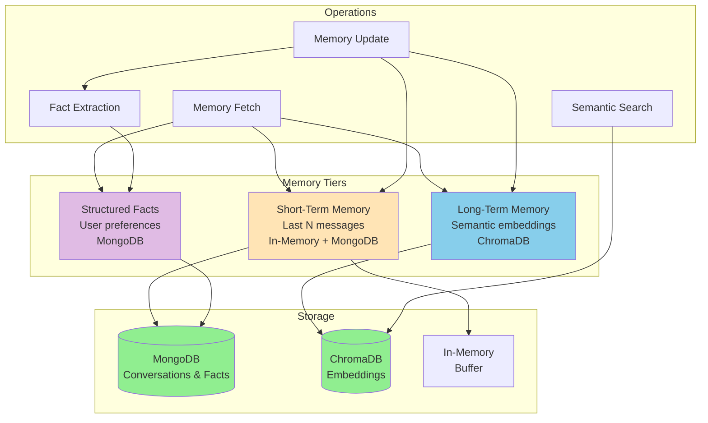
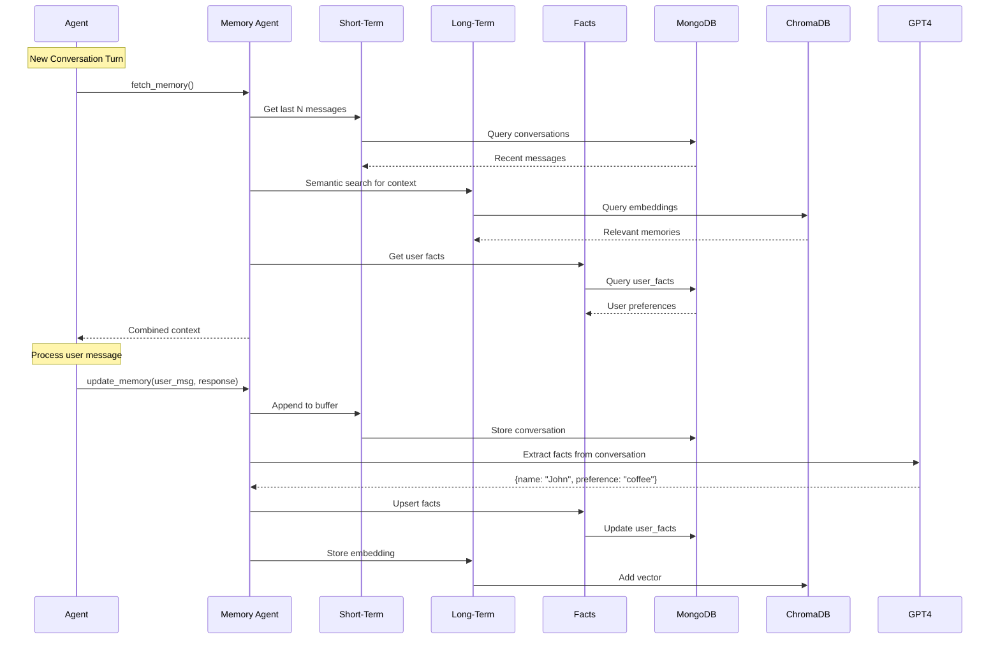
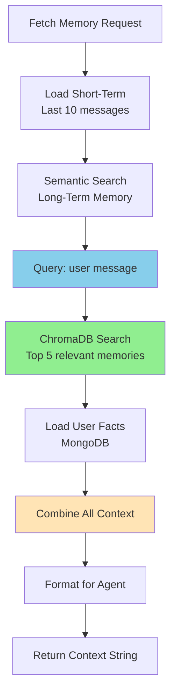
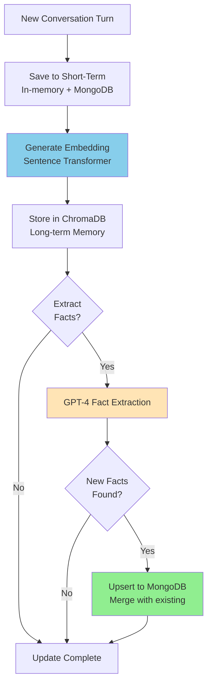
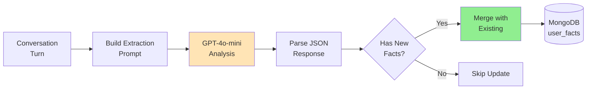

# Memory System - Persistent Conversation Context

Comprehensive documentation for the intelligent memory management system with short-term, long-term, and structured fact storage.

---

##  Table of Contents

- [Overview](#overview)
- [Architecture](#architecture)
- [Memory Types](#memory-types)
- [Memory Operations](#memory-operations)
- [Storage Backends](#storage-backends)
- [Memory Workflow](#memory-workflow)
- [Fact Extraction](#fact-extraction)
- [Configuration](#configuration)
- [API Reference](#api-reference)
- [Best Practices](#best-practices)

---

##  Overview

The Memory System provides **persistent conversation context** across multiple sessions, enabling agents to:

-  **Remember conversation history** for context-aware responses
-  **Extract and store user facts** (preferences, information)
-  **Retrieve relevant context** using semantic search
-  **Persist across sessions** for long-term continuity
-  **Fast retrieval** with hybrid storage (in-memory + database)

### Key Features

- **Three-tier architecture** - Short-term, long-term, structured facts
- **Semantic search** - ChromaDB vector storage for similarity matching
- **Automatic fact extraction** - GPT-4 identifies important information
- **Scalable storage** - MongoDB for structured data, ChromaDB for embeddings
- **Zero cost embeddings** - Local Sentence Transformers (no API fees)
- **Session isolation** - Per-user, per-thread memory management

---

##  Architecture

### Three-Tier Memory System



### Data Flow



---

##  Memory Types

### 1. Short-Term Memory

**Purpose:** Recent conversation context for immediate coherence

**Storage:**
- **In-memory buffer** for active session
- **MongoDB** for persistence across restarts

**Characteristics:**
- **Window size:** Last 10-20 messages (configurable)
- **Fast access:** Direct array lookup
- **Retention:** Current session + persistent storage
- **Use case:** Multi-turn conversations

**Example:**
```python
short_term = [
    {"role": "user", "content": "What's the weather?"},
    {"role": "assistant", "content": "It's sunny, 72°F"},
    {"role": "user", "content": "Should I bring an umbrella?"},
    {"role": "assistant", "content": "No, it's sunny today"}
]
```

---

### 2. Long-Term Memory

**Purpose:** Semantic memory for retrieving relevant past conversations

**Storage:**
- **ChromaDB** vector database
- **Embeddings** generated by Sentence Transformers

**Characteristics:**
- **Unlimited retention** (all conversations)
- **Semantic search** using cosine similarity
- **Indexed by context** not chronology
- **Use case:** "Remember when we talked about...?"

**Example:**
```python
# Query: "What did I say about my vacation?"
# Retrieves from conversation 2 weeks ago even if 1000 messages since
```

**Embedding Process:**
```python
from sentence_transformers import SentenceTransformer

model = SentenceTransformer('all-MiniLM-L6-v2')
text = "User mentioned they prefer morning meetings"
embedding = model.encode(text)  # 384-dimensional vector

# Store in ChromaDB
collection.add(
    ids=["mem_123"],
    embeddings=[embedding.tolist()],
    documents=[text],
    metadatas={"timestamp": "2024-10-28", "user_id": "user_123"}
)
```

---

### 3. Structured Facts

**Purpose:** Extracted user information and preferences

**Storage:**
- **MongoDB** structured documents
- **GPT-4 extracted** from conversations

**Characteristics:**
- **Key-value pairs** for easy lookup
- **Automatically updated** as new info learned
- **Persistent** across all sessions
- **Use case:** Personalization, preferences

**Schema:**
```json
{
  "_id": "ObjectId(...)",
  "user_id": "user_123",
  "thread_id": "thread_abc",
  "facts": {
    "name": "John",
    "occupation": "Software Engineer",
    "preferences": {
      "communication_style": "concise",
      "meeting_time": "mornings",
      "timezone": "America/New_York"
    },
    "interests": ["AI", "Python", "Machine Learning"]
  },
  "updated_at": "2024-10-28T14:30:00Z"
}
```

**Fact Extraction Example:**
```
Conversation:
User: "I'm John, I work as a software engineer. I prefer morning meetings."

Extracted Facts:
{
  "name": "John",
  "occupation": "Software Engineer",
  "preferences": {
    "meeting_time": "mornings"
  }
}
```

---

##  Memory Operations

### Memory Fetch

**When:** Before processing user message

**Purpose:** Retrieve context for agent

**Process:**



**Implementation:**

```python
def fetch_memory(user_message: str) -> str:
    """Fetch combined memory context"""

    # 1. Short-term (last N messages)
    recent = fetch_short_term()
    short_term_context = format_messages(recent)

    # 2. Long-term (semantic search)
    query_embedding = embed_text(user_message)
    results = collection.query(
        query_embeddings=[query_embedding],
        n_results=5
    )
    long_term_context = "\n".join(results['documents'][0])

    # 3. Structured facts
    facts = facts_col.find_one({"user_id": user_id, "thread_id": thread_id})
    facts_context = format_facts(facts['facts']) if facts else ""

    # 4. Combine
    combined = f"""
Short-term context (recent):
{short_term_context}

Long-term memories (relevant):
{long_term_context}

User facts:
{facts_context}
    """

    return combined
```

---

### Memory Update

**When:** After agent responds

**Purpose:** Store new conversation turn

**Process:**



**Implementation:**

```python
async def update_memory(user_message: str, agent_response: str):
    """Update all memory tiers"""

    # 1. Add to short-term
    timestamp = datetime.now()
    conversation = {
        "user_id": user_id,
        "thread_id": thread_id,
        "messages": [
            {"role": "user", "content": user_message},
            {"role": "assistant", "content": agent_response}
        ],
        "timestamp": timestamp
    }
    conversations_col.insert_one(conversation)

    # 2. Add to long-term (ChromaDB)
    memory_text = f"User: {user_message}\nAssistant: {agent_response}"
    embedding = embed_text(memory_text)

    collection.add(
        ids=[f"mem_{timestamp.timestamp()}"],
        embeddings=[embedding.tolist()],
        documents=[memory_text],
        metadatas={
            "timestamp": timestamp.isoformat(),
            "user_id": user_id,
            "thread_id": thread_id
        }
    )

    # 3. Extract facts
    new_facts = await extract_facts(memory_text)
    if new_facts:
        # Merge with existing facts
        existing = facts_col.find_one({"user_id": user_id, "thread_id": thread_id})
        if existing:
            merged = deep_merge(existing['facts'], new_facts)
            facts_col.update_one(
                {"_id": existing['_id']},
                {"$set": {"facts": merged, "updated_at": timestamp}}
            )
        else:
            facts_col.insert_one({
                "user_id": user_id,
                "thread_id": thread_id,
                "facts": new_facts,
                "created_at": timestamp,
                "updated_at": timestamp
            })
```

---

##  Fact Extraction

### Extraction Process

**Powered by:** GPT-4o-mini

**Trigger:** After each conversation turn

**Process:**



### Extraction Prompt

```python
FACT_EXTRACTION_PROMPT = """
Analyze this conversation and extract any factual information about the user.

Conversation:
{conversation_text}

Extract facts in the following categories:
- Personal info (name, occupation, location, etc.)
- Preferences (communication style, time preferences, tools, etc.)
- Interests (hobbies, topics, technologies, etc.)
- Goals (short-term, long-term)
- Constraints (availability, limitations, requirements)

Return JSON format:
{
  "name": "...",
  "occupation": "...",
  "preferences": {...},
  "interests": [...],
  "goals": [...],
  "constraints": [...]
}

Only include facts explicitly stated or clearly implied. Return {} if no facts found.
"""
```

### Example Extraction

**Input:**
```
User: "I'm Sarah, a data scientist working on ML projects. I prefer async communication and am based in PST timezone."
Assistant: "Thanks for sharing! I'll keep that in mind. What ML frameworks do you use?"
```

**Extracted:**
```json
{
  "name": "Sarah",
  "occupation": "Data Scientist",
  "location": "PST timezone",
  "preferences": {
    "communication_style": "async",
    "work_focus": "ML projects"
  }
}
```

---

##  Storage Backends

### MongoDB Collections

**1. conversations** - Message history
```json
{
  "_id": "ObjectId(...)",
  "user_id": "ObjectId(...)",
  "thread_id": "thread_abc",
  "messages": [
    {"role": "user", "content": "..."},
    {"role": "assistant", "content": "..."}
  ],
  "timestamp": "2024-10-28T14:30:00Z"
}
```

**2. user_facts** - Extracted facts
```json
{
  "_id": "ObjectId(...)",
  "user_id": "ObjectId(...)",
  "thread_id": "thread_abc",
  "facts": {
    "name": "...",
    "occupation": "...",
    "preferences": {...}
  },
  "updated_at": "2024-10-28T14:30:00Z"
}
```

**Indexes:**
```javascript
// For fast lookups
conversations.createIndex({"user_id": 1, "thread_id": 1, "timestamp": 1})
user_facts.createIndex({"user_id": 1, "thread_id": 1})
```

---

### ChromaDB Collections

**Collection naming:** `memory_{user_id}_{thread_id}`

**Document structure:**
```python
{
  "id": "mem_1698504000.123",
  "embedding": [0.123, -0.456, ...],  # 384-dim vector
  "document": "User: ... Assistant: ...",
  "metadata": {
    "timestamp": "2024-10-28T14:30:00Z",
    "user_id": "user_123",
    "thread_id": "thread_abc"
  }
}
```

**Query example:**
```python
# Find similar past conversations
results = collection.query(
    query_embeddings=[query_embedding],
    n_results=5,
    where={"user_id": "user_123"}
)
```

---

##  Configuration

### Memory Config

**File:** `memory/mem_config.py`

```python
class MemoryConfig:
    # Short-term memory
    short_term_window: int = 10  # Last N messages

    # Long-term memory
    chroma_db_dir: str = "./data/chroma_db"
    memory_collection_prefix: str = "memory"

    # Semantic search
    top_k_memories: int = 5  # Number of relevant memories
    min_similarity: float = 0.3  # Minimum similarity score

    # Fact extraction
    enable_fact_extraction: bool = True
    fact_extraction_model: str = "gpt-4o-mini"

    # MongoDB
    mongo_uri: str = "mongodb://localhost:27017"
    db_name: str = "agentic_rag"

    # Embedding
    use_local_embeddings: bool = True
    local_embedding_model: str = "all-MiniLM-L6-v2"
```

---

##  API Reference

### MemoryAgent Class

**Initialization:**
```python
from memory.mem_agent import MemoryAgent

memory = MemoryAgent(
    user_id="user_123",
    thread_id="thread_abc",
    cfg=MemoryConfig()
)
```

---

### Methods

**fetch_short_term()**
```python
def fetch_short_term() -> List[Dict[str, Any]]:
    """Get last N messages from MongoDB"""
    # Returns: [{"role": "user", "content": "..."}, ...]
```

**fetch_long_term(query: str)**
```python
def fetch_long_term(query: str, top_k: int = 5) -> List[str]:
    """Semantic search in ChromaDB"""
    # Returns: ["User: ... Assistant: ...", ...]
```

**fetch_facts()**
```python
def fetch_facts() -> Dict[str, Any]:
    """Get user facts from MongoDB"""
    # Returns: {"name": "...", "preferences": {...}, ...}
```

**update_memory(user_msg: str, assistant_msg: str)**
```python
async def update_memory(user_msg: str, assistant_msg: str):
    """Store conversation turn and extract facts"""
    # Stores in:
    # - MongoDB conversations
    # - ChromaDB long-term memory
    # - MongoDB user_facts (if new facts found)
```

---

##  Best Practices

### 1. Memory Window Sizing

**Short-term window:**
```python
# Small (5-7 messages): Fast, focused
short_term_window = 5

# Medium (10-15): Balanced (recommended)
short_term_window = 10

# Large (20+): More context, slower
short_term_window = 20
```

**Trade-offs:**
- **Larger window:** More context, higher token usage
- **Smaller window:** Faster, but may miss context

---

### 2. Semantic Search Tuning

**Similarity threshold:**
```python
# Strict (0.7-1.0): Only very similar memories
min_similarity = 0.7

# Balanced (0.4-0.6): Recommended
min_similarity = 0.5

# Loose (0.1-0.3): More results, less relevant
min_similarity = 0.2
```

---

### 3. Fact Extraction

**When to enable:**
```
✅ Long-term user relationships
✅ Personalization important
✅ User shares explicit preferences

❌ Anonymous sessions
❌ Privacy-sensitive contexts
❌ Cost-sensitive scenarios (uses GPT-4)
```

**Disable extraction:**
```python
cfg = MemoryConfig()
cfg.enable_fact_extraction = False
```

---

### 4. Collection Cleanup

**Periodic maintenance:**

```python
# Delete old memories (e.g., >90 days)
from datetime import datetime, timedelta

cutoff = datetime.now() - timedelta(days=90)

# ChromaDB
collection.delete(
    where={"timestamp": {"$lt": cutoff.isoformat()}}
)

# MongoDB
conversations_col.delete_many({
    "timestamp": {"$lt": cutoff}
})
```

---

##  Troubleshooting

### Issue: Memory not persisting

**Cause:** MongoDB connection error

**Solution:**
```bash
# Check MongoDB status
systemctl status mongod

# Verify connection
python -c "from pymongo import MongoClient; print(MongoClient('mongodb://localhost:27017').server_info())"
```

---

### Issue: Irrelevant memories retrieved

**Cause:** Similarity threshold too low

**Solution:**
```python
# Increase minimum similarity
cfg.min_similarity = 0.6

# Or reduce top_k
cfg.top_k_memories = 3
```

---

### Issue: Facts not extracted

**Cause:** Extraction disabled or no clear facts in conversation

**Solution:**
```python
# Ensure extraction enabled
cfg.enable_fact_extraction = True

# Check GPT-4 response manually
result = await extract_facts("User: I'm John, a developer")
print(result)  # Should show {"name": "John", "occupation": "developer"}
```

---

##  Performance

### Benchmarks

**Memory fetch** (10-message short-term, 5-memory semantic search):
- Short-term retrieval: 5-10ms
- ChromaDB search: 20-50ms
- Fact lookup: 5ms
- **Total:** 30-65ms

**Memory update**:
- MongoDB insert: 5-10ms
- ChromaDB add: 15-25ms
- Fact extraction: 500-2000ms (GPT-4 call)
- **Total:** 520-2035ms

---

##  Further Reading

- [Main README](../README.md)
- [Agentic RAG](AGENTIC_RAG.md)
- [Agentic AI](AGENTIC_AI.md)
- [Tools Documentation](TOOLS.md)
- [Guardrails](GUARDRAILS.md)

---

**Powered by ChromaDB, MongoDB, and Sentence Transformers**
