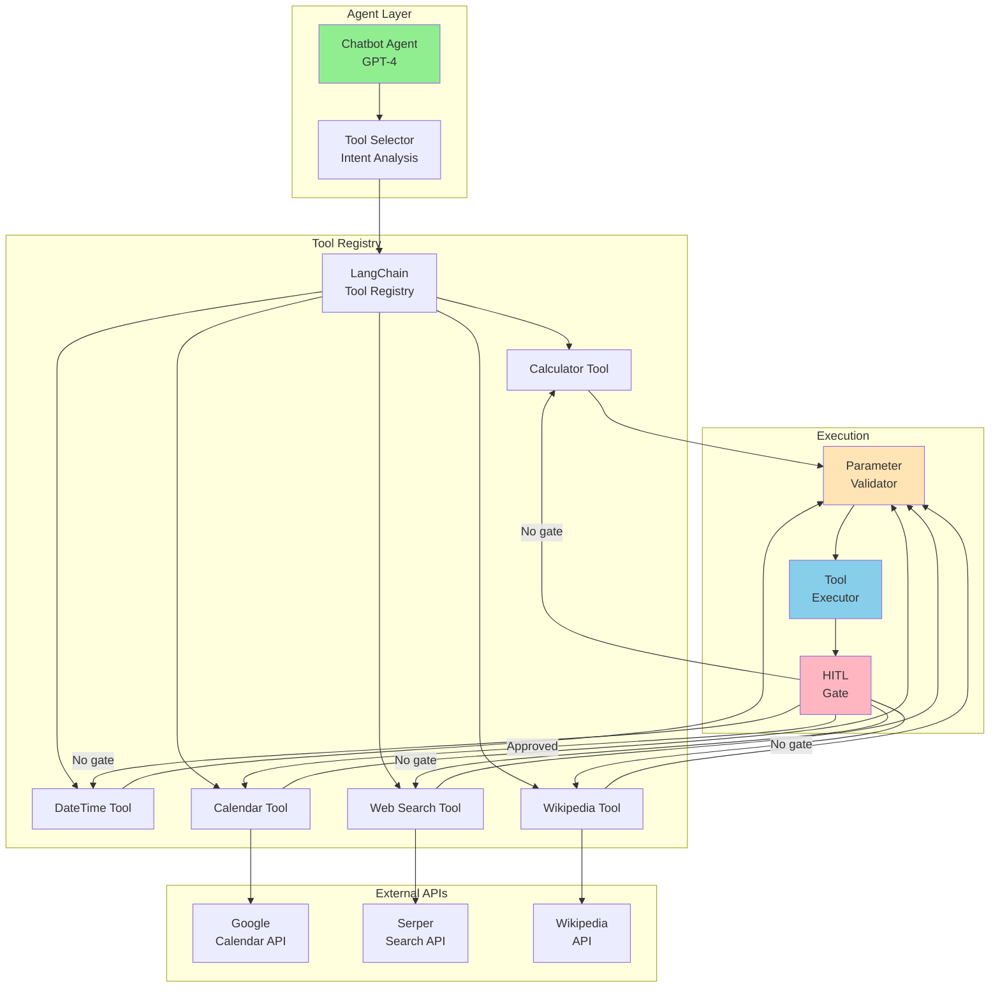
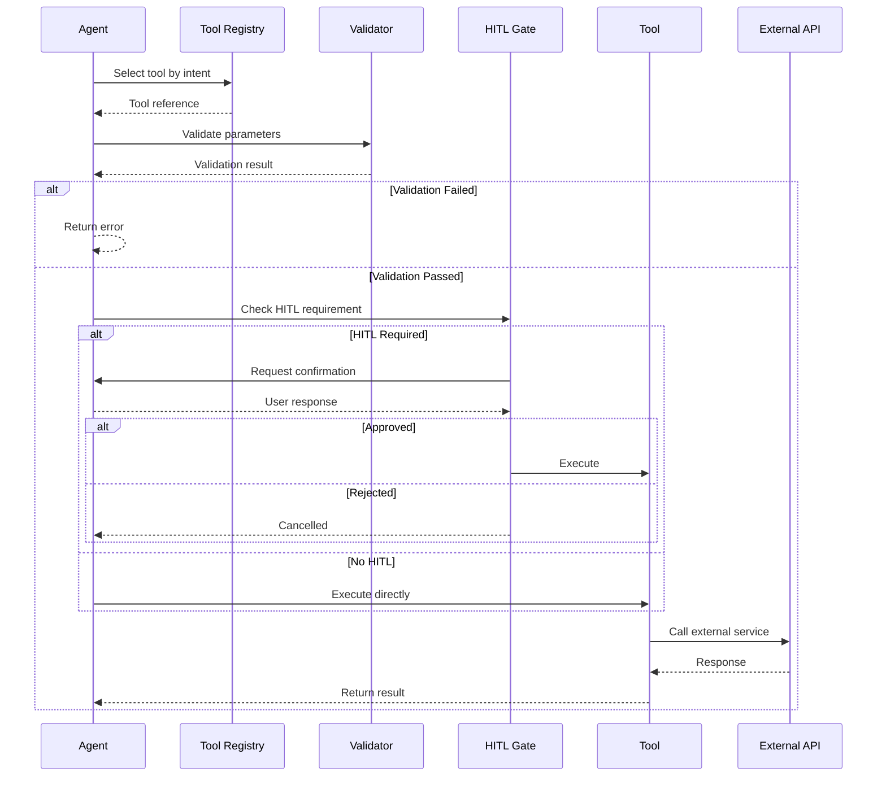

# Tools - External Capabilities Integration

Comprehensive documentation for all integrated tools that extend the agent's capabilities beyond language understanding.

---

##  Table of Contents

- [Overview](#overview)
- [Tool Architecture](#tool-architecture)
- [Available Tools](#available-tools)
- [Calculator Tool](#calculator-tool)
- [DateTime Tool](#datetime-tool)
- [Google Calendar Tool](#google-calendar-tool)
- [Web Search Tool](#web-search-tool)
- [Wikipedia Tool](#wikipedia-tool)
- [Creating Custom Tools](#creating-custom-tools)
- [Error Handling](#error-handling)
- [Best Practices](#best-practices)

---

##  Overview

The Tools system provides **external capabilities** to the AI agents, enabling them to perform actions beyond text generation:

-  **Mathematical calculations** and unit conversions
-  **Calendar management** with event creation/retrieval
-  **Web search** for current information
-  **Wikipedia queries** for factual knowledge
-  **Date/time operations** and timezone handling

### Key Features

- **LangChain integration** - Standard @tool decorator
- **Type-safe** - Pydantic schema validation
- **Error handling** - Graceful degradation on failures
- **Human-in-the-loop** - Confirmation for sensitive actions
- **Async support** - Non-blocking tool execution
- **Observable** - Tool usage tracking and logging

---

##  Tool Architecture

### Component Diagram



### Tool Lifecycle



---

##  Calculator Tool

**File:** `tools/calculator_tool.py`

### Overview

Performs mathematical calculations and unit conversions using safe expression evaluation.

### Functions

#### `calculate(expression: str) -> str`

Evaluate mathematical expressions safely.

**Parameters:**
- `expression` (str): Math expression to evaluate

**Returns:**
- str: Result of calculation

**Examples:**
```python
calculate("15% of 2500")  # → "375.0"
calculate("(45 + 67) * 2.5")  # → "280.0"
calculate("sqrt(144)")  # → "12.0"
calculate("sin(pi/2)")  # → "1.0"
```

**Supported Operations:**
- Basic: `+`, `-`, `*`, `/`, `**` (power), `%`
- Functions: `sqrt()`, `sin()`, `cos()`, `tan()`, `log()`, `exp()`
- Constants: `pi`, `e`
- Percentages: "X% of Y"

**Safety:**
```python
# Uses ast.parse + whitelist approach
# Prevents: eval("__import__('os').system('rm -rf /')")
# Allows: eval("2 + 2")
```

---

#### `convert_units(value: float, from_unit: str, to_unit: str) -> str`

Convert between different units of measurement.

**Parameters:**
- `value` (float): Value to convert
- `from_unit` (str): Source unit
- `to_unit` (str): Target unit

**Returns:**
- str: Converted value with unit

**Examples:**
```python
convert_units(100, "km", "miles")  # → "62.137 miles"
convert_units(32, "fahrenheit", "celsius")  # → "0.0°C"
convert_units(5, "kg", "pounds")  # → "11.023 lbs"
convert_units(1, "gallon", "liters")  # → "3.785 L"
```

**Supported Unit Categories:**

| Category | Units |
|----------|-------|
| Distance | km, miles, meters, feet, yards, inches |
| Temperature | celsius, fahrenheit, kelvin |
| Weight | kg, pounds, grams, ounces, tons |
| Volume | liters, gallons, milliliters, cups, pints |
| Area | sqm, sqft, acres, hectares |
| Speed | kmh, mph, ms (meters/sec) |

---

### Implementation

```python
from langchain_core.tools import tool
import ast
import operator
import math

@tool
def calculate(expression: str) -> str:
    """
    Perform mathematical calculations safely.

    Args:
        expression: Math expression (e.g., "2 + 2", "sqrt(16)", "15% of 200")

    Returns:
        Result of the calculation
    """

    # Handle percentage expressions
    if "%" in expression and "of" in expression:
        parts = expression.split("of")
        percent = float(parts[0].strip().replace("%", ""))
        value = float(parts[1].strip())
        return str((percent / 100) * value)

    # Safe eval using AST
    allowed_ops = {
        ast.Add: operator.add,
        ast.Sub: operator.sub,
        ast.Mult: operator.mul,
        ast.Div: operator.truediv,
        ast.Pow: operator.pow,
        ast.USub: operator.neg,
    }

    allowed_functions = {
        'sqrt': math.sqrt,
        'sin': math.sin,
        'cos': math.cos,
        'tan': math.tan,
        'log': math.log,
        'exp': math.exp,
    }

    allowed_constants = {
        'pi': math.pi,
        'e': math.e,
    }

    def eval_node(node):
        if isinstance(node, ast.Constant):
            return node.value
        elif isinstance(node, ast.BinOp):
            return allowed_ops[type(node.op)](
                eval_node(node.left),
                eval_node(node.right)
            )
        elif isinstance(node, ast.UnaryOp):
            return allowed_ops[type(node.op)](eval_node(node.operand))
        elif isinstance(node, ast.Call):
            func_name = node.func.id
            if func_name in allowed_functions:
                args = [eval_node(arg) for arg in node.args]
                return allowed_functions[func_name](*args)
        elif isinstance(node, ast.Name):
            if node.id in allowed_constants:
                return allowed_constants[node.id]
        raise ValueError(f"Unsupported operation: {node}")

    try:
        tree = ast.parse(expression, mode='eval')
        result = eval_node(tree.body)
        return str(result)
    except Exception as e:
        return f"Calculation error: {str(e)}"
```

---

##  DateTime Tool

**File:** `tools/datetime_tool.py`

### Overview

Comprehensive date/time operations including timezone conversions, date arithmetic, and calendar generation.

### Functions

#### `get_current_datetime(timezone: str = "UTC") -> str`

Get current date and time in specified timezone.

**Examples:**
```python
get_current_datetime()  # → "2024-10-28 14:30:00 UTC"
get_current_datetime("America/New_York")  # → "2024-10-28 10:30:00 EDT"
```

---

#### `calculate_date_difference(date1: str, date2: str) -> str`

Calculate difference between two dates.

**Examples:**
```python
calculate_date_difference("2024-10-01", "2024-12-25")  # → "85 days"
calculate_date_difference("2024-01-01", "2025-01-01")  # → "366 days"
```

---

#### `add_days_to_date(date: str, days: int) -> str`

Add or subtract days from a date.

**Examples:**
```python
add_days_to_date("2024-10-28", 7)  # → "2024-11-04"
add_days_to_date("2024-10-28", -30)  # → "2024-09-28"
```

---

#### `get_day_of_week(date: str) -> str`

Get day of week for a given date.

**Examples:**
```python
get_day_of_week("2024-10-28")  # → "Monday"
get_day_of_week("2024-12-25")  # → "Wednesday"
```

---

#### `convert_timezone(datetime_str: str, from_tz: str, to_tz: str) -> str`

Convert datetime between timezones.

**Examples:**
```python
convert_timezone("2024-10-28 14:00", "UTC", "America/New_York")
# → "2024-10-28 10:00 EDT"

convert_timezone("2024-10-28 09:00", "Asia/Tokyo", "Europe/London")
# → "2024-10-28 01:00 BST"
```

**Supported Timezones:** All IANA timezone database entries
- `America/New_York`, `America/Los_Angeles`
- `Europe/London`, `Europe/Paris`
- `Asia/Tokyo`, `Asia/Shanghai`
- `Australia/Sydney`, etc.

---

#### `get_calendar_month(year: int, month: int) -> str`

Generate ASCII calendar for a month.

**Example:**
```python
get_calendar_month(2024, 10)
```

**Output:**
```
    October 2024
Mo Tu We Th Fr Sa Su
    1  2  3  4  5  6
 7  8  9 10 11 12 13
14 15 16 17 18 19 20
21 22 23 24 25 26 27
28 29 30 31
```

---

#### `time_until_date(target_date: str) -> str`

Calculate time remaining until a target date.

**Examples:**
```python
time_until_date("2024-12-25")  # → "57 days, 12 hours, 30 minutes"
time_until_date("2025-01-01")  # → "64 days"
```

---

##  Google Calendar Tool

**File:** `tools/google_calendar_tool.py`

### Overview

Manage Google Calendar events with human-in-the-loop approval for event creation.

### Setup

**1. Enable Google Calendar API:**
```bash
# Go to Google Cloud Console
# Enable Calendar API
# Create OAuth 2.0 credentials
# Download credentials.json
```

**2. Place Credentials:**
```
project/
├── credentials.json  ← Google OAuth credentials
└── token.json        ← Auto-generated after first auth
```

**3. First Run:**
```python
# Triggers OAuth flow in browser
# Grants calendar access
# Saves token.json for future use
```

---

### Functions

#### `get_calendar_events(date: str = None) -> str`

List calendar events for a specific date.

**Parameters:**
- `date` (str, optional): Date in YYYY-MM-DD format. Defaults to today.

**Returns:**
- str: Formatted list of events

**Examples:**
```python
get_calendar_events()  # Today's events
# → "Events for 2024-10-28:
#    1. Team Meeting (10:00-11:00)
#    2. Lunch with Client (12:00-13:00)
#    3. Code Review (15:00-16:00)"

get_calendar_events("2024-10-29")  # Tomorrow's events
```

---

#### `create_calendar_event(...) -> str` [HITL Required]

Create a new calendar event **with user confirmation**.

**Parameters:**
- `summary` (str): Event title
- `start_time` (str): Start time (ISO 8601)
- `end_time` (str): End time (ISO 8601)
- `description` (str, optional): Event description
- `attendees` (List[str], optional): Email addresses
- `location` (str, optional): Event location

**Returns:**
- str: Event creation result with Google Calendar link

**Examples:**
```python
await create_calendar_event(
    summary="Team Standup",
    start_time="2024-10-29T10:00:00",
    end_time="2024-10-29T10:30:00",
    description="Daily team standup meeting",
    attendees=["team@company.com"],
    location="Conference Room A"
)
```

**HITL Flow:**
1. Agent calls tool
2. System shows confirmation modal to user:
   ```
   Create Calendar Event?

   Title: Team Standup
   When: Oct 29, 2024 10:00 AM - 10:30 AM
   Attendees: team@company.com
   Location: Conference Room A

   [Approve] [Reject]
   ```
3. User approves/rejects
4. If approved, event created:
   ```
   Event created: https://calendar.google.com/calendar/event?eid=...
   ```
5. If rejected:
   ```
   Event creation cancelled by user
   ```

---

### Implementation Example

```python
from langchain_core.tools import tool
from google.oauth2.credentials import Credentials
from googleapiclient.discovery import build

@tool
async def create_calendar_event(
    summary: str,
    start_time: str,
    end_time: str,
    description: str = "",
    attendees: List[str] = [],
    location: str = ""
) -> str:
    """
    Create a Google Calendar event (requires user confirmation).

    Args:
        summary: Event title
        start_time: Start time in ISO format (e.g., "2024-10-29T10:00:00")
        end_time: End time in ISO format
        description: Event description
        attendees: List of attendee email addresses
        location: Event location

    Returns:
        Event creation result with link
    """

    # Build event
    event = {
        'summary': summary,
        'location': location,
        'description': description,
        'start': {
            'dateTime': start_time,
            'timeZone': 'UTC',
        },
        'end': {
            'dateTime': end_time,
            'timeZone': 'UTC',
        },
        'attendees': [{'email': email} for email in attendees],
        'reminders': {
            'useDefault': True,
        },
    }

    # Request HITL confirmation
    confirmed = await request_hitl_confirmation(
        action="create_calendar_event",
        event_details=event
    )

    if not confirmed:
        return "Event creation cancelled by user"

    # Create event
    service = build('calendar', 'v3', credentials=get_credentials())
    created_event = service.events().insert(
        calendarId='primary',
        body=event,
        sendUpdates='all'  # Send email notifications
    ).execute()

    return f"Event created successfully! {created_event.get('htmlLink')}"
```

---

##  Web Search Tool

**File:** `tools/serper_tool.py`

### Overview

Search the web for current information using the Serper API.

### Setup

**Get API Key:**
```bash
# Sign up at https://serper.dev
# Get API key
# Add to .env:
SERPER_API_KEY=your_api_key_here
```

### Functions

#### `search_web(query: str, num_results: int = 5) -> str`

Search the web for information.

**Examples:**
```python
search_web("latest AI developments 2024", num_results=3)
```

**Returns:**
```
Web search results for "latest AI developments 2024":

1. Title: Major AI Breakthroughs in 2024
   URL: https://example.com/ai-2024
   Snippet: This year saw significant advances in...

2. Title: OpenAI Releases GPT-5
   URL: https://example.com/gpt5
   Snippet: OpenAI announced the release of...

3. Title: AI Regulation Update
   URL: https://example.com/ai-regulation
   Snippet: New regulations for AI systems...
```

---

#### `search_news(query: str, num_results: int = 5) -> str`

Search recent news articles.

**Examples:**
```python
search_news("climate change policy", num_results=5)
```

**Returns:**
```
News search results for "climate change policy":

1. Title: New Climate Bill Passes Senate
   Source: News Outlet
   Date: 2 hours ago
   URL: https://example.com/news1

2. Title: Global Climate Summit Announced
   Source: International News
   Date: 5 hours ago
   URL: https://example.com/news2
```

---

##  Wikipedia Tool

**File:** `tools/wikipedia_tool.py`

### Overview

Query Wikipedia for factual information.

### Functions

#### `search_wikipedia(query: str) -> str`

Search for Wikipedia articles.

**Examples:**
```python
search_wikipedia("Python programming language")
```

**Returns:**
```
Wikipedia search results for "Python programming language":

1. Python (programming language)
2. Python Software Foundation
3. History of Python
4. Comparison of programming languages
5. List of Python software
```

---

#### `get_wikipedia_page(title: str) -> str`

Get full Wikipedia article content.

**Examples:**
```python
get_wikipedia_page("Python (programming language)")
```

**Returns:**
```
Python (programming language)

Python is a high-level, interpreted, general-purpose programming language. Its design philosophy emphasizes code readability with the use of significant indentation...

[Full article content - first 1000 words]

Source: https://en.wikipedia.org/wiki/Python_(programming_language)
```

---

##  Creating Custom Tools

### Tool Template

```python
from langchain_core.tools import tool
from typing import Optional

@tool
def my_custom_tool(
    param1: str,
    param2: int,
    param3: Optional[str] = None
) -> str:
    """
    Brief description of what this tool does.

    This description helps GPT-4 understand when to use this tool.
    Be clear and specific about the tool's purpose and capabilities.

    Args:
        param1: Description of parameter 1
        param2: Description of parameter 2
        param3: Optional parameter with default

    Returns:
        Description of what is returned
    """

    try:
        # Validate parameters
        if not param1:
            return "Error: param1 is required"

        if param2 < 0:
            return "Error: param2 must be positive"

        # Perform tool logic
        result = perform_operation(param1, param2, param3)

        # Return formatted result
        return f"Success: {result}"

    except Exception as e:
        # Handle errors gracefully
        return f"Tool error: {str(e)}"
```

### Adding to Agent

**File:** `graph/chat_node.py`

```python
from tools.my_custom_tool import my_custom_tool

# Add to tool list
all_chatbot_tools = [
    # Existing tools
    search_wikipedia,
    calculate,
    # ... other tools

    # Your custom tool
    my_custom_tool
]
```

---

##  Further Reading

- [Main README](../README.md)
- [Agentic RAG](AGENTIC_RAG.md)
- [Agentic AI](AGENTIC_AI.md)
- [Memory System](MEMORY.md)
- [Guardrails](GUARDRAILS.md)

---

**Powered by LangChain Tools Framework**
